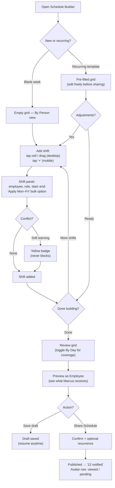
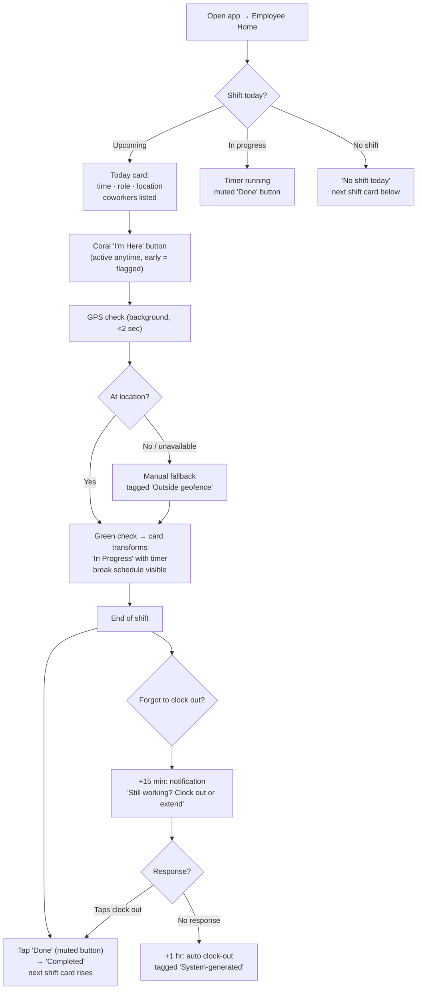
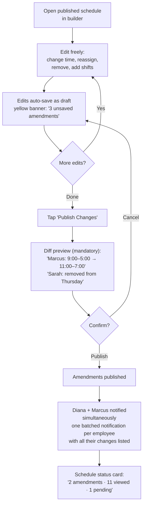
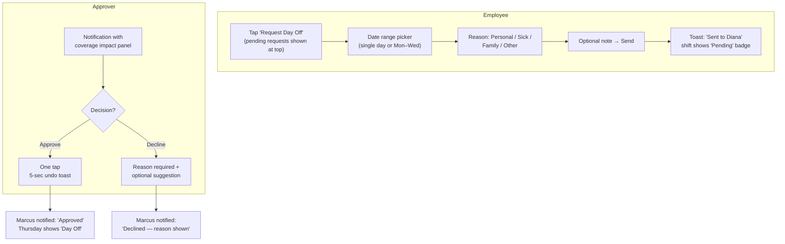
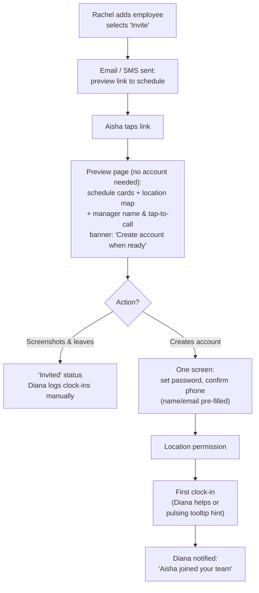
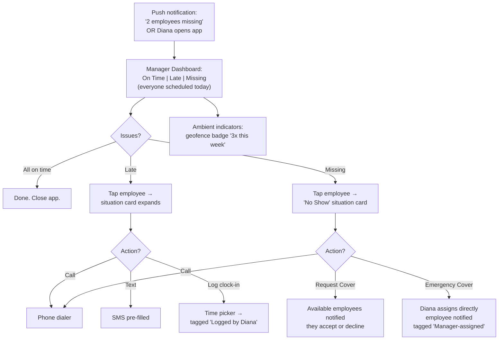

# UX Design Specification SCHEDULER

**Author:** Basestaff
**Date:** 2026-02-19

---

## Executive Summary

### Project Vision

SCHEDULER is a team coordination layer for SMBs (5-50 employees) that unifies scheduling, attendance, and timesheets into one connected experience. The UX thesis: the integration itself is the product — not scheduling features, not time tracking features, but the seamless flow between them. The design philosophy — "information surface, not rule engine" — means the system warns and guides but never blocks business decisions.

### Target Users

**Rachel (Owner/Super Admin)** — The Sunday-night scheduler. Builds weekly schedules on desktop via paint-mode drag-to-schedule. Monitors attendance via 10-second phone glances on weekday mornings. Exports timesheets monthly. UX must deliver sub-10-minute scheduling and passive adoption visibility. Needs light mobile editing (single-shift reassignment) for same-day changes at the register.

**Diana (Manager)** — The morning safety net. Department-scoped view of her 6 people. Handles exceptions: missed clock-ins, same-day coverage gaps, leave approvals. Operates almost entirely on mobile, between tasks. UX must deliver scoped clarity — her team only, problems surfaced proactively. Drill-down from status to action in 2 taps maximum.

**Marcus (Employee)** — The daily habit. Opens app, sees one card, taps one button. His entire interaction is: see shift → tap in → tap out → check next week → request days off. UX must deliver radical simplicity — two queries, sub-200ms, zero navigation. By day 30, the interaction is muscle memory, not cognition.

**Aisha (New Hire)** — The zero-friction onboarder. Receives a schedule preview link before her first day. No app install, no account required. Converts to full user when she needs to clock in or request a day off — not before. The transition from preview to full app should be invisible — same page gains new capabilities after account creation.

### Key Design Challenges

1. **Schedule Builder dual-mode** — Desktop power tool (drag, assign, conflict warnings, keyboard nav) vs. mobile tap-to-reassign for single-shift changes. Tablet breakpoint is the critical seam. Creating new shifts remains desktop-only in V1.

2. **Clock-in in hostile environments** — Large, full-width touch target in fixed screen position (same spot for clock-in and clock-out — muscle memory). Card state transformation as confirmation (dramatic button → "CLOCKED IN" header), not full-screen takeover. GPS verification shown as ambient indicator (pulsing → checkmark or amber). Amber state includes reassuring copy — no panic.

3. **Notification hierarchy across three attention spans** — Critical notifications (shift changes, rejected requests) use red accent and persist until acknowledged. Informational notifications (schedule shared, team member joined) use neutral styling and auto-clear after 48 hours. Smart batching: 3+ informational within an hour collapse into summary. Critical never batch.

4. **Preview-to-account conversion patience** — Contextual prompts at moment of intent, not persistent banners. When Aisha taps a locked feature (Next Week, Request Day Off), the conversion prompt appears inline. After 2-week grace period, prompts become more assertive for employees still on preview-only. Manual clock-in by Diana includes "Remind employee to create account?" prompt.

5. **Dashboard restraint** — Manager home screen IS the team status, no intermediary. "All clear" is an explicit positive message ("All 6 here"), not absence of red. Status updates animate in place — no manual refresh. Drill-down from status = situation card (shift info + actions), not a profile page.

6. **Cold-start gap** — Setup wizard must end with employee invitations as the final step, then guide directly to "Build your first schedule" with sample template option. Every empty state shows the next action, never just "nothing here yet."

7. **Invisible value when working** — Weekly summary notification ("58 of 60 shifts covered, 2 late arrivals") and monthly "time saved" insight provide passive value reinforcement for owners who only engage during schedule creation.

### Design Opportunities

1. **Shift card as narrative device** — Single card with state transitions (Upcoming → Clock In → In Progress → Completed) tells the day's story. After clock-out, primary card becomes next scheduled shift — always forward-looking. Pending day off requests visible inline on schedule view. Shifts differing from recurring pattern are visually marked.

2. **Unified action feed** — Merge notifications and approvals into a single feed on the manager/owner home screen. Informational items = read-only cards. Actionable items = cards with swipe-to-reveal buttons (tap to confirm). Eliminates a navigation destination and puts everything managers care about in one scroll. Desktop uses hover-reveal buttons.

3. **One-tap principle extended** — Long-press a shift on schedule view to request that day off with default reason (full 3-tap form still available for non-contextual requests). Approvals: swipe-to-reveal + tap to confirm. 5-second undo toast on all approval actions.

4. **Employee schedule sharing** — Employees can share their own read-only schedule link (their shifts only). Extends the zero-app philosophy to the employee's family/support network. Low-effort feature with outsized daily-life impact.

5. **Compact top bar navigation** — Replace sidebar with top bar on desktop. Reclaims ~240px of horizontal space for the schedule builder grid. Mobile uses bottom nav; top bar on desktop with same icon set for visual consistency. Timesheets get their own top-level nav destination (not buried under schedules).

6. **Availability as collaboration** — Elevate availability from buried settings to prompted, visible action. Frame as "Tell Rachel when you're available" not "Set your availability preferences." Prompt employees to update when new schedule period approaches.

7. **Right-sized scheduling** — Quick schedule list mode for small teams (≤8): "Monday 9-5: pick employees" → visualize as grid for review. First-time flow asks mental model preference: "By day" (list) or "By person" (grid). Builder opens pre-filled from recurring template when recurrence is set. Defaults to next unscheduled period. Unfilled slots visually loud — completeness readable at a glance.

8. **Seamless onboarding** — No first-use tutorial overlays. Preview-to-app transition in place (same page gains capabilities). Conversion form uses same visual language as preview. Preview page designed for screenshotting (large readable shift times). End-of-month timesheet notification with deep link eliminates navigation hunts.

## Core User Experience

### Defining Experience

The product's atomic unit is the **person-time-place commitment** — a person expected somewhere at a specific time. Its primary representation is the shift card, but the commitment renders differently per surface: a grid cell in the builder, a card on the employee home screen, a status row on the team dashboard, a line item on the preview link, a line in the timesheet.

**Visual consistency contract:** The shift card must have a defined visual grammar — color = role, border/accent = status, layout = time + person + place — recognizable across all 5 rendering surfaces. Same data, adapted rendering, consistent language. This is the design system foundation.

**Radial dependency model:**

- Rachel (generates) → Commitment Data
- Marcus (personal lens) ← Commitment Data
- Diana (team lens) ← Commitment Data

Rachel is the generator. Marcus and Diana are consumers with different lenses. The dependency is radial, not sequential — both consume from the same source simultaneously.

**Two session types, two UX postures:**
- **Creation sessions** (schedule building, employee management, settings): focused, deliberate, desktop-dominant. Show full creation chrome.
- **Consumption sessions** (clock-in, status check, approvals): quick, ambient, mobile-dominant. Strip to essentials — don't show creation chrome during consumption.

**Passive viewing is the true frequency driver.** Marcus opens the app to check "when do I work?" more often than he clocks in. The home screen is optimized for viewing (most common action) with clock-in prominently available (most important action). Most opens are to check, not to act.

### Platform Strategy

**Role determines device context** — not "mobile-first with one desktop exception":

| Role | Device Context | UX Posture |
|------|---------------|------------|
| Employee | Phone-only | Consumption only — view, tap, done |
| Manager | Phone-primary | Consumption + lightweight intervention |
| Owner | Dual-device: laptop for creation, phone for monitoring | Two distinct experiences, not one responsive page |

| Surface | Primary Platform | Input Mode | Offline |
|---------|-----------------|------------|---------|
| Schedule Builder (paint-mode) | Desktop (1024px+) | Mouse + keyboard | No |
| Schedule Builder (list-mode for ≤8) | Desktop + Tablet | Click / Tap | No |
| Schedule Reassignment | Mobile + Desktop | Tap / Click | No |
| Clock-in/out | Mobile (phone) | Touch (one thumb) | Yes (localStorage) |
| Team Status | Mobile (phone, glance) | Read-only + tap drill-down | No |
| Action Feed | Mobile (phone, on-the-go) | Swipe + tap | No |
| Schedule View (employee) | Mobile (phone) | Touch (scroll, toggle) | No |
| Schedule Preview | Mobile (any browser) | Read-only | No |
| Timesheets / Export | Desktop | Click | No |
| Settings / Admin | Desktop | Click + form input | No |

**Scaling considerations (50+ employees):**
- Schedule builder supports filtering by department/location — build one team's schedule at a time
- Team status groups by department/location with roll-up summary: "Location A: 14/15 here"
- Employee picker supports search and role/department filtering
- Notifications aggregate at scale: "3 employees missing at Downtown" not 3 separate alerts

### Effortless Interactions

**Split: effortless execution vs. informed decisions.**
- **Execution interactions** (clock-in, clock-out, view schedule, export timesheets) — zero thought. The decision is already made; the user is executing.
- **Decision interactions** (schedule creation, approvals, coverage management) — minimize friction around the decision while respecting that the human is thinking. Show the right information, remove unnecessary steps.

**Effortless execution:**
1. **Timesheet generation** — Zero input. Hours compute from clock events with break deductions. Rachel exports.
2. **Schedule viewing** — Open app, shift is there. Sub-200ms. No navigation.
3. **Clock-in** — One tap, fixed screen position (same spot as clock-out — muscle memory). Card state transformation as confirmation.
4. **Recurring schedule** — Builder opens pre-filled from template. 2 adjustments, share. 3-4 minutes.
5. **Adoption monitoring** — Schedule card shows viewed/pending avatars. No report to check.

**Informed decisions:**
1. **Scheduling** — Builder shows availability conflicts, role gaps, unfilled slots (visually loud). Rachel decides; system informs.
2. **Approvals** — Leave request card shows coverage impact before Diana acts. Swipe-to-reveal, tap to confirm.
3. **Exception handling** — Diana's drill-down from status = situation card (shift info + available actions), not profile page. 2 taps max.

**Clock-in specifics:**
- Clock-in time = tap time, not GPS verification time. GPS confirms location, not time. Clock event records both: `tapped_at` and `verified_at`.
- Configurable grace period on "Late" status (default 5 minutes). Clock-in within grace period = "On Time."
- GPS verification shown as ambient indicator: pulsing → checkmark (verified) or amber (failed). Amber state: "Clock-in recorded. Location couldn't be verified — your manager has been notified. No action needed from you."
- Primary action button (clock-in/clock-out) owns fixed bottom position. Secondary actions (request day off, view details) are consistent but recessive — in card body or contextual menu.

**Schedule change communication:**
- Amendment notification includes diff inline: "Your Wednesday shift changed: ~~9:00-5:00~~ → 10:00-6:00." Notification IS the information.
- On schedule view, changed shifts carry a "Changed" badge persisting 48 hours or until acknowledged.

**Timesheet clarity:**
- Timesheet view shows scheduled hours AND actual hours per employee with delta highlighted: "Marcus: Scheduled 160h, Actual 172h (+12h). Early arrivals +5h, late departures +7h."
- Export includes "round to schedule" option: events within configurable buffer (e.g., 15 min) of shift boundary rounded. Rachel chooses: pay exact or pay scheduled.
- Lightweight "hours this week" summary on team status dashboard — ambient proof the system is working without waiting for end-of-month export.

### Critical Success Moments

Five make-or-break moments:

| Moment | What Happens | If We Fail |
|--------|-------------|-----------|
| Rachel's first Monday morning | Glances at team status — "All 8 clocked in" | Doesn't trust the system, back to texting |
| Marcus's first clock-in | Taps "I'm Here" → card transforms to "CLOCKED IN · 9:02 AM" | Unsure if it worked, loses confidence |
| Rachel's first payroll export | Timesheets complete with scheduled vs. actual breakdown | "The numbers are wrong" — trust destroyed |
| Aisha's preview-to-app transition | Taps invite link, password form pre-filled with invite email, schedule appears | Email mismatch creates empty account, support ticket |
| Rachel's first recurring week | Builder pre-filled, 2 edits, shared in 3 minutes | "Faster to use my spreadsheet" — value doesn't compound |

**Draft protection:** If Rachel builds a schedule and closes the builder without sharing, a persistent "Draft schedule — not yet shared" indicator follows her across devices. Background job sends reminder notification 48 hours before the period starts. Builder auto-saves drafts — closing the browser doesn't lose work.

**Onboarding protection:** Account creation from preview link pre-fills invitation email (non-editable). If someone signs up with an unmatched email: "This email wasn't invited. Did your manager use a different email? Try [a••••k@gmail.com]."

**Approval protection:** Undo toast timeout pauses when network is unavailable — persists until connectivity returns + 5 seconds. "Withdraw approval" action available for 1 hour after approval, sends employee a clear "Diana withdrew approval" message distinct from rejection.

### Experience Principles

Six principles governing every UX decision:

1. **Every screen answers one question about a commitment.** Employee home: "What's my next commitment?" Team status: "Who's meeting their commitments?" Schedule builder: "What commitments am I creating?" Timesheets: "What commitments were fulfilled?" If a screen can't state its one question, it's unfocused.

2. **Forward-looking for action, backward-looking for record.** Action surfaces (home, dashboard, feed) answer "what's next?" — the default landing. Record surfaces (timesheets, clock history, audit log) answer "what happened?" — one tap deeper. You never land on history; you navigate to it.

3. **Ambient for context, explicit for exceptions.** Normal-state information (co-workers on shift, viewed/pending avatars, publish day expectation) is ambient — embedded where the user already looks. Exception-state information (rejected requests, unfilled slots, GPS failures) is explicit — notifications, badges, warnings. Test: if ignoring it causes a problem, it must be explicit.

4. **Earn every interruption — and let users adjust the bar.** Default hierarchy: critical (red accent, persistent until acknowledged) vs. informational (neutral, auto-clear after 48 hours). Smart batching: 3+ informational within an hour collapse into summary. Critical never batch. Notification preferences accessible per category in settings — Marcus can mute "schedule shared" if he checks manually. Action feed carries a badge count on navigation for pending actionable items.

5. **Primary action, same thumb, same spot.** Clock-in/out button owns fixed bottom position — label and color change per state, position never moves. Secondary actions are consistent but recessive. The app builds muscle memory for the primary action; everything else is discoverable.

6. **Inform, warn, prevent.** Three-tier constraint model:
   - **Inform** (blue/neutral): "Sarah has low availability on Wednesdays." Ambient. No action required.
   - **Warn** (yellow): "Marcus scheduled for 50 hours — potential overtime." Requires acknowledgment. Dismissable.
   - **Prevent** (red): "Exceeds maximum consecutive days per labor regulations." Blocks action. Not dismissable.
   V1 ships inform + warn. Prevent requires jurisdiction configuration (Growth phase). Design language accommodates all three from day one.

**Supporting design rules:**
- Action feed items deep-link to the affected shift card for immediate context
- Contextual settings entry points on related surfaces (gear icons, "Customize" links) — don't rely on users navigating to Settings
- Preview-to-app is a redirect with visual continuity (same schedule data alongside password form), not an in-place page transformation
- Diana has dual-mode UX: surveillance (passive, read-only team status) and intervention (active, manual clock-in, coverage swap, approvals) — both supported without making surveillance feel like a control panel

## Desired Emotional Response

### Primary Emotional Goals

| Persona | End-State Emotion | What It Means |
|---------|------------------|---------------|
| Rachel (Owner) | **Ownership** | "This is MY system." Two years of templates, patterns, and customized roles accumulate into a tool shaped by her decisions. Not just confident delegation — the app belongs to her. |
| Diana (Manager) | **Respected competence** | The system trusts her judgment. Actions execute on tap with undo toast — no "are you sure?" dialogs. Her screen shows her team only. Professional, scoped, no noise. |
| Marcus (Employee) | **Taken-for-granted** | Like electricity. By day 30, the interaction is muscle memory — open, see shift, tap in, done. He doesn't think about the app. That's the highest compliment. |
| Aisha (New Hire) | **Job-readiness** | Belonging before bureaucracy. Preview link works before signup. Account creation + 2FA feels like "I have a real job with real tools," not another hoop. |

### Emotional Journey Map

| Phase | Rachel | Diana | Marcus | Aisha |
|-------|--------|-------|--------|-------|
| Day 1 | Anxiety — "Will this replace my spreadsheet?" | Cautious — "Another tool to learn" | Skeptical — "Do I really need this?" | Nervous — "What's expected of me?" |
| Week 1 | Relief — first schedule shared, adoption visible | Clarity — team scoped, problems surfaced | Surprise — one tap, done | Relief — preview link shows shifts, no signup needed |
| Month 1 | Verification — cross-checks timesheets against what she knows | Confidence — exceptions handled in 2 taps | Habit — stops noticing the app | Security confidence — 2FA completed, account feels real |
| Month 3+ | Ownership — templates, patterns, "my system" | Respected authority — trusted to act without confirmation | Taken-for-granted — infrastructure | Job-readiness — just another part of work |

### Emotional Micro-Moments

Three interactions where emotion deviates from obvious and requires explicit design:

1. **Clock-in confirmation** — Emotion: quiet satisfaction, not celebration. The "I'm Here" button transforms into "CLOCKED IN · 9:02 AM" header. State change IS the feedback. No praise, no confetti, no "Great job!" Individual actions get transformation; patterns get ambient acknowledgment (streaks visible to managers on team status, never on employee home screen).

2. **GPS amber state** — Emotion: informed, not soothed. Show facts, not reassurance. "Clock-in recorded. Location unverified — your manager has been notified." Full stop. Adult tone. No "No action needed from you" — that's parenting.

3. **Employee archive** — Emotion: acknowledged, not deleted. When a long-tenured employee is archived: "Sarah's shifts have been cleared from upcoming schedules. Template updated." Losing 3 years of scheduling patterns is a significant moment — don't make deleting a person feel like deleting a row.

All other interactions follow from the three emotional design principles — no per-interaction emotional specification needed.

### Emotional Design Principles

Three principles governing all emotional design decisions:

1. **Warmth lives in content, not chrome.** Faces, names, co-workers on shift, team presence — these ARE the warmth. No greeting messages, no encouragement copy, no decorative emotion. Execution paths (clock-in, clock-out) are pure function. Dwell surfaces (team status, schedule builder, employee profile) are human. The selfie avatar is both warmth AND data — it stays everywhere. When no selfie is uploaded, the initials avatar uses the role color and looks intentional, not incomplete. No "profile incomplete" badges for missing selfies.

2. **Confirm through facts, celebrate through patterns.** Individual actions get state transformation (button → header). Never per-action praise. Patterns get ambient acknowledgment — managers see streaks on team status ("Marcus: 22 days on time"), weekly summaries frame data as Rachel's achievement ("Your team: 58/60 covered"), and monthly insights surface improvement ("On-time rate improved 8% this month"). The app creates conditions for human recognition without performing it. "All clear" weeks reinforce value through occasional positive data points — prevent "do I even need this?" erosion.

3. **Every identity surface looks complete at minimum input.** Initials avatar is a design choice, not a fallback. Selfie and IC enhance but their absence is never visible as a gap. Archiving a person acknowledges impact. 2FA frames as "your account is secured" — professional trust, not bureaucratic friction. The system treats every employee as a whole person at every stage of their lifecycle.

### Employee Profile & Identity

**Selfie (optional):** Uploaded during onboarding or from profile settings. Renders as avatar across all surfaces — team status, schedule builder grid cells, action feed, employee roster. In the schedule builder, selfie avatars in grid cells make over-scheduling visible — Rachel sees faces, not just names, and notices when one person appears too often. The selfie is a scheduling quality tool disguised as a warmth feature.

**IC (Identity Card):** Upload for verification and storekeeping. Visible to owner/admin only. Framed as professional record-keeping — "Your ID is securely stored" — a dignity signal for hourly workers who are rarely asked to provide credentials through professional channels.

**Account creation:** Email + 2-step verification required for all users (employees and employers). SMS code preferred over authenticator app for accessibility. For Aisha, the 2FA step lands between preview (no account) and full app access — the moment should feel like stepping into a professional role, not clearing a security checkpoint.

### Design Implications

**Builder first-use:** The schedule builder must echo familiar spreadsheet patterns — grid, drag, fill. Not a new paradigm to learn. Rachel should feel like her spreadsheet upgraded itself, not that she enrolled in a course.

**Value before admin:** Setup wizard ends at "invite employees." Configuration happens contextually as needs arise. The emotional promise: build your first schedule before you configure a single setting.

**Ownership artifact:** Rachel needs a place where her accumulated decisions are visible — template list growing over time, "Based on your 47 previous schedules," role colors she chose. Ownership needs a tangible surface. No competitor can replicate two years of her patterns.

**Manager respect:** Diana's actions execute immediately with 5-second undo toast. No confirmation dialogs. The undo pattern IS the respect — we assume she meant it, but give her a safety net. Swipe-to-reveal, tap to confirm, undo available. Three steps, zero "are you sure?"

**"All clear" is a feature, not absence.** "All 6 here" is an explicit positive message with faces. Silence between schedule creation and payroll should never feel like the app stopped working. Weekly summary, monthly insight, ambient hours-this-week on dashboard — proof the system is continuously earning its place.

## UX Pattern Analysis & Inspiration

### Inspiring Products Analysis

**1. Courtsite — Timetable Scheduler**

Courtsite solves court booking with a time-slot grid: resources on one axis, time on the other. What makes it work for SCHEDULER:

- **Grid-as-truth:** The timetable IS the product. No dashboard intermediary — land on the grid, see what's available. Color blocks = booked, empty = open. Zero interpretation.
- **Tap-to-claim:** See a slot, tap it, it's yours. The grid cell is both display and action target.
- **Visual density from simple units:** Lots of information per screen through repetition of a simple cell — time + status. Density from pattern, not from cramming.
- **White space as signal:** Gaps are visible as empty cells. The eye finds openings before the brain reads text.

**Courtsite's limitation:** Not mobile-native (score: 6/10), no role-specific views (3/10), no emotional warmth (3/10). SCHEDULER starts from Courtsite's grid clarity and extends into the territory Courtsite doesn't touch.

**2. ClickUp — All-Round Management**

ClickUp teaches through both its strengths and its mistakes:

- **Multiple views, same data:** List, Board, Calendar, Gantt — same tasks, different lenses. Validates SCHEDULER's grid/list mode toggle.
- **Progressive disclosure:** Basic task creation = title + assignee. Power features available without being imposed.
- **Notification overload as cautionary tale:** Every action generates noise. Users learn to ignore everything. The anti-pattern SCHEDULER must avoid.
- **General-purpose flexibility as liability:** ClickUp can be anything, meaning it's nothing out of the box. SCHEDULER's domain knowledge (shifts, clock-ins, coverage gaps) IS the product. Customize the vocabulary (roles, departments, locations), not the structure (what a shift is, how clock-in works).

**ClickUp's only advantage is customization — and that's a trap.** SCHEDULER intentionally targets constrained customization. Custom roles are essential business vocabulary. Custom fields, custom workflows, custom views are complexity Marcus doesn't need.

### Interaction Model: Card-Centric with Role-Shaped Arrangement

The shift card is the universal atomic unit. Every surface is a collection of cards, arranged differently per role:

- **Rachel (builder):** Cards in a grid — drag, resize, multi-select. Role colors dominate cells. Grid-as-painting: she paints the week in role colors, gaps are white space.
- **Diana (manager):** Cards as a status flow — Expected → Active → Completed. People-list pattern (closer to WhatsApp than Courtsite). Tap = situation card with 2-3 actions.
- **Marcus (employee):** One card — next shift. Queue model: current shift = now playing, next shift = up next, week view = full queue. Always forward-looking. Never a grid.
- **Aisha (preview):** Cards as a clean document list — large text, dates, times. Screenshot-friendly. No app chrome.

The card IS the person-time-place commitment. One design component, five rendering modes. Color = role, border = status, layout = time + person + place. Navigation follows card collections ("My Shifts," "My Team," "Schedule," "Timesheets"), not features.

### Transferable UX Patterns

**From Courtsite:**
- Grid-as-truth for the schedule builder — Rachel lands on the grid, not a dashboard
- Tap-to-claim cells — click empty cell → employee picker inline, no modal chains
- Color density from simple repeating units — role color fills/borders the cell
- White space as alert — unfilled slots communicate through emptiness, no warning badge needed

**From ClickUp:**
- Multiple views, same data — grid/list toggle on the same page
- Progressive disclosure — shift creation = employee + time + role (3 fields). Expandable for notes, breaks, role override

**From Spotify (playlist curation):**
- "Suggest fill" for empty slots — builder offers pattern-based employee suggestions from historical scheduling data. Rachel accepts or ignores. The system learned HER patterns.
- Schedule sharing as social act — "viewed by" avatars reinforce the publishing moment
- Pattern mirror in summaries — "Marcus averaged 32h, you scheduled 38h this week." Not a warning — a mirror.
- Employee home as "Up Next" queue — current shift, next shift, week queue. Always forward.

**From restaurant kitchen (ticket system):**
- Team status as flowing board — Expected → Active → Completed. Diana reads temporal flow, not static indicators.
- Progressive urgency escalation — late clock-in escalates: 5 min = amber, 10 min = red + floats to top, 30 min = critical + persistent. Not a single threshold.
- "86'd" visual for absences — called-out/day-off employees shown dimmed with label, distinct from empty (never scheduled). Tells Diana "was planned, now gone."
- End-of-shift summary — when last team member clocks out, a summary card appears: "Evening shift complete. 6/6 out. 47.5h total." Clean closure.

**From ride-sharing apps:**
- Fixed-position primary action — "I'm Here" button owns bottom of screen, always visible, same spot. Borrowed from Uber's "Request Ride," not from either inspiration app.

**From Google Docs:**
- Auto-save — no "Save" button in the builder. Continuous save. Share is the only explicit action.
- Share = save + publish + notify — one button, one action, schedule released.

**From shared document links (Google Docs, Notion):**
- Preview without login — the link works in any browser, no account required.
- Progressive capability — same page, same URL, capabilities unlock after auth. Preview becomes app in place.

**From mobile banking:**
- 2FA shows the "prize" — schedule visible (blurred/dimmed) behind verification form. Motivation to complete security.

### Builder-Specific Patterns

- **Select vs. assign distinction:** Click = select (highlight). Double-click or drag = assign. Prevents accidental assignments when scrolling.
- **Role in basic creation flow:** Shift creation = employee + time + role. Role is not progressive disclosure — it's the third core field.
- **Role colors dominate the grid:** Wide left border or cell background fill. At grid zoom, Rachel reads color distribution before text. "Too much blue, not enough green" is a 2-second scan.
- **Template-with-diffs:** Builder opens showing recurring template with approved changes already applied (approved leave = shift removed). Changed cells carry subtle "adjusted" indicator. Rachel refines on top of what the system prepared.
- **Selfie avatars in grid cells:** Faces make over-scheduling visible. Rachel notices one face appearing too many times.
- **Optimistic UI:** Builder actions register instantly. Server confirms in background.

### Manager-Specific Patterns

- **Situation card (not profile page):** Purpose-built "what's wrong + what can I do" card with 2-3 actions maximum: Call, Text, Log Manual Clock-In. Diana's primary interaction unit.
- **Batched morning notifications:** "Morning shift: 5/6 clocked in. Marcus pending." One notification instead of five. Deep-links to the exception.
- **Swipe-to-reveal with tap fallback:** Large hit area for swipe gesture. On cheap phones where swipe is unreliable, tap expands action buttons as fallback.
- **End-of-shift summary card:** When last team member clocks out, summary appears naturally — clean closing ritual.

### Employee-Specific Patterns

- **Default notifications = only MY shifts.** Shift changed, request approved/denied, clock-in issue. Nothing else by default. Opt-in for more.
- **No grid, ever.** Card for next shift, list for week view. Never a schedule grid on the employee view.
- **Clock-in = light switch.** Visible on open, same spot, instant. 4-second total interaction from app launch to phone back in pocket.

### Preview & Onboarding Patterns

- **Preview link = document, not app.** Large text, no navigation chrome, high contrast, screenshot-friendly. Clean schedule list designed for WhatsApp sharing.
- **2FA with schedule visible behind.** Blurred/dimmed schedule in background of verification form — the motivation to complete.
- **Post-signup = same page, new capabilities.** No redirect to dashboard, no "Welcome!" screen. The schedule list gains clock-in button and "Request Day Off." Same content, added functionality.

### Anti-Patterns to Avoid

1. **Notification avalanche** (from ClickUp) — Smart batching, per-category preferences, critical vs. informational. Earn every interruption.
2. **Configuration-before-value** (from ClickUp) — Build first schedule before configuring settings. Value before admin.
3. **Navigation sprawl** (from ClickUp) — 4-5 top-level destinations maximum. Every nav slot earned.
4. **Generic customization** (from ClickUp) — No custom fields, custom statuses, workflow builders. Domain opinions are the product. Custom roles = yes (business vocabulary). Custom everything else = no.
5. **Modal chains** (anti-Courtsite) — Cell is both display and interaction target. No modal → form → confirm → success.
6. **"Are you sure?" dialogs** — Manager actions execute on tap with undo toast. Confirmation dialogs signal distrust.
7. **Static status lists** — Team status should show temporal flow (Expected → Active → Completed), not just red/green dots.

## Design System Foundation

### Technology Choice

**Tailwind CSS + Radix UI primitives (shadcn/ui pattern).** Tailwind provides full styling control without runtime cost on budget phones. Radix provides accessible interactive primitives (dialogs, dropdowns, tooltips) with ARIA compliance built in. shadcn/ui pattern means we own the component code — no library dependency, full customization.

### Visual Foundation

**Semantic Color Palette:**
Three-layer architecture — raw hex values → semantic names → components. Components reference semantic names (`action-primary`, `surface-primary`, `text-muted`), never raw colors. Dark mode = remap the semantic layer. Zero component changes. System-preference dark mode (`prefers-color-scheme: dark`) ships in Phase 1 — color tokens fully defined for both mappings from day one.

**Spacing Scale (4px base grid):**
`0, 4, 8, 12, 16, 24, 32, 40, 48, 64`. Every padding, margin, and gap in the app uses ONLY these values. No arbitrary spacing. This creates visual rhythm across every surface.

**Typography Scale:**
Mode-specific sizes for the shift card: compact (grid cell), standard (list/status), prominent (primary card). General UI typography follows standard scale (xs through xl). Font choices optimized for readability at small sizes on mobile and scannability at desktop grid scale.

**Role Color System:**
12 curated default colors, all passing WCAG AA contrast against white text. Users can create additional roles with custom colors. Two roles may share a color if their icons differ. Role colors bypass the semantic token layer — stored in the database, applied dynamically.

### Shift Card Grammar

The shift card is the visual representation of a person-time-place commitment. One visual grammar, adapted per context.

**Visual contract:** Color = role. Border/accent = status. Layout = time + person + place. Recognizable across all rendering contexts.

**Card States:**

| State | Visual | Trigger |
|-------|--------|---------|
| **Upcoming** | Default, role color, time prominent | Shift exists in future |
| **Clock-In Available** | Primary action button appears, fixed bottom position | Within clock-in window of shift start |
| **In Progress** | "CLOCKED IN · 9:02 AM" header, active accent border. Light haptic on transition (confirmation, not celebration) | Employee taps clock-in |
| **Completed** | Muted, role color desaturated, actual times shown | Employee taps clock-out |
| **86'd / Absent** | Dimmed, strikethrough, "Day Off" or "Called Out" label — distinct from empty (never scheduled) | Leave approved or no-show resolved |
| **Changed** | "Changed" badge, persists 48h or until acknowledged | Schedule amendment after publish |
| **Pending Sync** | Subtle pulse indicator | Offline action awaiting connectivity |
| **Sync Failed** | Amber indicator with retry action | Server rejected after reconnection |

**Rendering Contexts:**

| Context | Surface | What the User Sees |
|---------|---------|-------------------|
| Grid cell | Schedule builder | Role color fill/border, selfie avatar (micro), short time, employee name truncated. Rachel reads color distribution at a glance. |
| Primary card | Employee home | Full-width card, prominent time, role badge, location. Clock-in button at fixed bottom. Forward-looking — always shows next shift. |
| Status row | Manager dashboard | Horizontal row, avatar with status ring, name, shift time, status indicator. Tap = situation card. |
| List item | Schedule view / preview | Date + time + role + location. Clean, scannable, screenshot-friendly for preview links. |
| Timesheet line | Timesheet | Scheduled vs. actual hours, delta highlighted. Tabular layout for export readability. |

Each rendering context uses shared visual pieces (role badge, time display, avatar) with context-appropriate display variants (compact, standard, full).

**Builder Grid Layouts:**

Rachel chooses her mental model on first use:
- **"By person":** Rows = employees, columns = days. Each cell = one shift (or empty). Rachel sees coverage per person.
- **"By day":** Rows = time blocks, columns = days. Employees appear as cell content. Rachel sees coverage per time slot.

Both layouts use the same grid cell visual. Builder available at ≥1024px (full: 7-day view with drag/resize/keyboard shortcuts), functional at 768-1023px (3-day window with horizontal scroll). Below 768px: schedule viewing only, no builder.

### Role Identification

Three independent channels — any one sufficient alone:

1. **Color:** Role-assigned color fills grid cells (background or wide left border). Primary channel for sighted users. Rachel reads role distribution as a color pattern.
2. **Short code:** 2-letter code (CB, FL, KB) displayed on grid cells and role badges. Essential for the ~8% of male users with color vision deficiency.
3. **Icon:** Role icon on badges and profiles. Secondary identifier providing additional context on hover/tap.

### Identity System

**Avatar:** Photo (selfie upload, optional) or initials with role color background. Initials avatar is a first-class design element — not a fallback, not an "incomplete profile." No missing-photo indicators.

**Layers (implemented incrementally):**
- Content + role background: Phase 1
- Status ring (green/amber/red/none): ships with manager dashboard
- Badge (notification count): ships with notification system

**Sizes:** Micro (24px, grid cell), small (36px, status/timesheet rows), medium (40px, list items), large (48px, primary card), hero (80px, profile).

### State Communication

**Empty states follow a formula:** [What's missing] + [What will make it appear] + [CTA if the user can act]. Every empty screen tells the user what to do next. "Nothing here yet" is forbidden.

**Notifications across channels:**
- **Push (mobile):** Title + short body + deep link. OS-constrained copy. Only personal-relevance events by default for employees.
- **In-app feed:** Two variants — informational (read-only, auto-clear 48h) and actionable (swipe-to-reveal or tap-to-expand actions, persists until resolved). Actionable items sort above informational.
- **Email:** Simplified shift info with role-color left border, time, person, and single "View in App" CTA. Always mirrors an in-app notification — email is a reach-out, never the only channel.

**Interaction-specific timing:**
- Clock-in card transformation: 300ms ease-in-out, light haptic
- Toast entry/exit: 150ms ease-out
- Card state changes: 200ms ease-in-out

**Confirmation model:**
- Routine manager actions (approve, manual clock-in): execute on tap + 5-second undo toast. No "are you sure?"
- Destructive actions (archive employee, delete schedule): informed confirmation with context ("Archiving Sarah will clear 3 upcoming shifts. Archive?"). Earns its existence by adding information.

## Defining Core Experience

### The Defining Experience

**"Open, see, tap, done."** Marcus opens the app, sees his shift card, taps "I'm Here," pockets his phone. 4 seconds. By day 30, muscle memory.

This is SCHEDULER's pivot point. Rachel paints the schedule → Marcus taps → Rachel sees the result. The tap transforms Rachel's schedule into Diana's dashboard and Rachel's timesheets. Without reliable clock-in, the product degrades to "just a scheduler" — which Rachel already had with her spreadsheet.

### Success Criteria

| Criteria | Experience |
|----------|-----------|
| App launch → card visible | Feels instant. Card shape visible immediately (native skeleton), data fills within a breath. |
| Tap → visual confirmation | No perceivable delay. Card transforms as Marcus's finger lifts. |
| Total flow | Faster than checking the time on a watch. App icon → phone back in pocket. |
| Button position | Same spot every day, every state. Thumb finds it without looking. |
| GPS verification | Ambient. Never blocks. Marcus doesn't wait for it. |
| Post-action interaction | Zero. No praise, no confirmation prompt, no "what's next." |
| Day 30 test | Marcus clocks in without conscious thought — like locking a door. |

### The Novel Pattern: CTA Becomes Confirmation

The action itself is established (tap a button). The innovation is what we REMOVE: navigation, loading, confirmation dialog, success animation, post-action prompt. The card state transformation replaces all of these — the "I'm Here" button disappears, "CLOCKED IN · 9:02 AM" appears as the header. **The CTA becomes the confirmation.**

Familiar metaphor: a light switch. Flip → light on. No dialog.

### Experience Mechanics

**1. Initiation — App Launch**

Marcus taps the app icon. Native splash shows shift card skeleton (same shape, same position). Data fills in. What he sees:

- **Top:** Minimal header (app name, notification bell)
- **Center:** Next shift card — full width. Day, date, start-end time, role badge, location. Co-worker avatars as ambient row.
- **Bottom (fixed):** "I'm Here" button. Full width, primary color, large touch target. Same position in every state.

**Card always present — content adapts:**

| Situation | Card Content |
|-----------|-------------|
| Shift coming up, within clock-in window | Shift details + "I'm Here" button |
| Before clock-in window | Shift details + "Shift starts at 9:00 AM" + secondary "Clock in early?" |
| Currently clocked in | In-progress card, active border, elapsed time, "CLOCK OUT" button |
| Day off, more shifts this week | "Day Off Today" card at top, next shift card below (forward-looking) |
| Split shift, between shifts | Next shift: "NEXT · Today 4:00 PM" |
| No shifts scheduled | "No shifts scheduled yet. Your manager will share your schedule soon." |
| Account deactivated | "Your account has been deactivated. Contact your manager for details." |

**Rule: in-progress shift ALWAYS takes priority.** If clocked in, home screen shows the in-progress card. Never an upcoming shift. Never "I'm Here" while already clocked in.

**2. Interaction — The Tap**

Marcus taps "I'm Here." Single tap. 500ms debounce prevents double-tap.

**Immediately (optimistic UI):**
- Button disappears
- Card header transforms to "CLOCKED IN · 9:02 AM" with active accent border
- Light haptic (a lock clicking shut — confirmation, not celebration)
- Timestamp = Marcus's tap time
- 5-second undo toast available

**In background:**
- Clock event sent to server. If offline, stored locally with automatic retry.
- GPS verification async. Success = ambient checkmark. Failure = amber: "Location unverified — your manager has been notified." Factual tone.
- Sync visibility escalates gradually: invisible when fast, amber bar if slow, explicit message if connection lost. Every sync message includes the word "recorded" — Marcus's tap succeeded, sync is pending.

**3. Feedback — The Transformation**

```
BEFORE:                              AFTER (300ms):
┌──────────────────────┐            ┌──────────────────────┐
│ TODAY · Monday        │            │ CLOCKED IN · 9:02 AM ✓│
│ 9:00 AM — 5:00 PM    │            │ ━━━━━━━━━━━━━━━━━━━━ │
│ ■ Cashier · Downtown  │            │ 9:00 AM — 5:00 PM    │
│ 👤👤 Sarah, Aisha     │            │ ■ Cashier · Downtown  │
│                       │            │ 👤👤 Sarah, Aisha     │
│ ┌──────────────────┐ │            │                       │
│ │    I'M HERE       │ │            │ ┌──────────────────┐ │
│ └──────────────────┘ │            │ │    CLOCK OUT      │ │
└──────────────────────┘            │ └──────────────────┘ │
                                    └──────────────────────┘
```

Header transforms. Active border appears. Button label + color change. Button POSITION stays fixed.

**4. Completion — Phone Away**

No step 4 for Marcus. Card transformed. Phone pocketed. If he reopens: in-progress card with elapsed time.

**Clock-out mirrors clock-in:** Same speed, same optimistic UI, same button position. After clock-out: brief completion line — "Today: 8h 2m" — visible for 2 seconds, then card forward-shifts to next scheduled shift. Marcus sees his one data point (hours worked today) without navigating anywhere.

**Clock-out guard:** Clock-out within 60 seconds of clock-in triggers: "You just clocked in. Clock out?" — the one exception to "no confirmation dialogs," because accidental clock-out is high-damage.

**Audio feedback:** Off by default. Optional subtle click toggle in settings for environments where visual/haptic aren't sufficient (noisy kitchens, gloves).

### Edge Cases & Resilience

| Scenario | Rule |
|----------|------|
| Budget phone, slow launch | Native skeleton shows card shape in < 100ms. Data fills at 1-3s. Thumb knows where button will be. |
| No shift today | Always a card: day-off card + next shift below. Never empty screen. |
| Early arrival | Secondary "Clock in early?" option. Flagged on timesheet, never blocked. |
| Double-tap | 500ms debounce + 60s clock-out guard. |
| Split shifts | Scan all remaining shifts today. Show next. Timesheet: separate entries. |
| Overnight shifts | Card shows correctly. Shift belongs to start date. |
| Phone dies mid-shift | Auto clock-out at scheduled end, flagged "not confirmed," correctable next day. |
| Server down | Optimistic UI holds. Retry in background. Manager sees "pending" not "missing." |
| GPS fails indoors | Ambient, never blocking. Configurable strictness. Wi-Fi as secondary signal. |
| Shared device (V1) | Manager logs manual clock-ins. |
| App update during shift window | Never blocks clock-in. Deferred until after shift. |
| Break time | Auto-deduction default (one clock-in, one clock-out). Manual break clock optional. |
| Mid-shift schedule change | Push notification with diff. Card updates live. |
| 3+ GPS failures in a week | Pattern alert to Rachel, not individual notifications. |

### Grace Period & Status Display

Within grace period (default 5 min) = "On Time" green status on manager dashboard. Exact timestamp available on drill-down only. Weekly summary uses aggregate: "98% on-time" — not per-employee minute breakdown.

Timesheet export default: "round to schedule" — within-grace arrivals round to scheduled start time. Rachel actively chooses "exact times" for minute-level data. **The protection against micro-scrutiny extends from dashboard to export.**

### GPS & Privacy

GPS is ambient, never blocking, configurable per employee. Location checked only at clock-in/out moments — never tracked between events. Store verified/unverified status only, no coordinates. "While Using" permission, visible access indicator. Businesses without fixed locations can disable GPS entirely — the defining experience works identically.

### Secondary Experiences (Powered by the Defining Experience)

**Diana's first-screen:** Team status list — her 6 people with status indicators flowing in real-time from their clock-in taps. Expected → Active → Completed. Exception = situation card with 2-3 actions. Her experience DEPENDS on Marcus's taps providing real-time data.

**Rachel's phone first-screen:** Aggregate team status — "All 8 here" with faces, or "7/8 — Marcus pending." Her "All 6 here" moment is the PROOF that the defining experience works. This is Rachel's emotional reward for choosing SCHEDULER.

### Language Contract

Throughout the app: "clock-in" = the action concept in the spec and code. "I'm Here" = the button label Marcus sees. "Time Recording" in settings, not "Attendance Tracking." "Location unverified" not "location failed." Every label says "the system serves you," never "you serve the system." This applies to every notification, setting name, and error message.

### Design Principles (Governing the Defining Experience)

1. **The system never blocks a clock-in.** Early, late, wrong location, offline — Marcus can ALWAYS record his presence. The system informs; Rachel decides.
2. **Aggregate first, individual on drill-down.** The first screen an employer sees should never enable punishment.
3. **"The system serves you" in every label.** Language defines the power relationship, repeated 200+ times per year.
4. **Speed protects the system, not just the user.** Every second added increases skip probability, cascading into manual work for managers.
5. **Compliance survives only through effortlessness.** Can't motivate with rewards (patronizing) or consequences (resentment). Only muscle memory works.

### Design Rationale

Five root truths from first-principles analysis:

1. **The 4-second target is a system resilience number.** It protects Diana and Rachel from cascading manual work when employees skip clock-in. Speed isn't convenience — it's infrastructure.
2. **Clock-in is the data generator.** Without it, scheduling is a spreadsheet, timesheets are copies, team status is fiction. Guard this feature above all others.
3. **Muscle memory is the only viable adoption strategy** for a mandatory action with no intrinsic reward. Rewards patronize. Consequences create resentment. Effortlessness is the only path.
4. **Optimistic UI is the honest UI.** The tap IS the record (stored locally). "Saving..." is less honest than showing the result. Sync is a system concern, not Marcus's problem.
5. **Button labels are emotional architecture.** "I'm Here" (Marcus declares) vs. "Clock In" (system demands). Over 200 annual taps, accumulated language shapes whether Marcus feels tracked or supported.

*V2 horizons: NFC tap-to-clock at entrance, lock screen widget, kiosk mode for shared devices.*

## Visual Design Foundation

### Color System

**Brand Anchor:** `#f56447` (warm coral) on `#FFFFFF` (white). Energetic and human without clinical blue-SaaS coolness. The coral is a swappable accent — the brand identity lives in white surfaces, role-color grids, and warm typography. A rebrand is a single token change, not a redesign.

**Semantic Color Tokens (light mode):**

| Token | Value | Usage |
|-------|-------|-------|
| `action-primary` | `#f56447` | Buttons (filled), links (text color), active borders, "I'm Here" CTA |
| `action-primary-hover` | `#e04f33` | Hover/pressed state for interactive elements |
| `action-primary-subtle` | `#fef0ee` | Selected row background, soft highlight |
| `surface-primary` | `#FFFFFF` | Page background. Floating elements (modals, dropdowns) use shadow for elevation, not a different surface color. |
| `surface-secondary` | `#F8F8FA` | Card background, section background |
| `text-primary` | `#1A1A2E` | Headings, primary body text |
| `text-secondary` | `#5C5C72` | Supporting text, labels |
| `text-muted` | `#9494A8` | Timestamps, hints, placeholders |
| `border-default` | `#E4E4EC` | Card borders, dividers. Focus rings use `action-primary` directly. |

**Status Colors:**

| Token | Value | Meaning | Examples |
|-------|-------|---------|---------|
| `status-success` | `#16A34A` | Positive / complete | On Time, All Here, Completed |
| `status-warning` | `#D97706` | Attention needed | Late (5-10 min), Pending, GPS unverified |
| `status-error` | `#DC2626` | Critical / destructive | Critical late (30+ min), Sync failed |
| `status-info` | `#2563EB` | Different / informational | Changed badge, Draft, New employee |

**Coral distinction from error red:** `#f56447` is warm, orange-tinted — "action." `#DC2626` is cool, blue-tinted — "problem." Reinforced contextually: coral always appears on interactive elements; error red always appears with warning icons and alert containers. The two never share the same UI pattern.

**The coral rule — one meaning:** Coral = "you can interact with this." On buttons (filled background, white text). On links (text color, underline on hover). On active states (borders, focus rings). Never decorative, never on non-interactive elements. This gives coral maximum signal value.

**Visual hierarchy by surface type:**
- **Builder grid:** Role colors dominate. Builder chrome (toolbars, buttons, nav) stays neutral (`text-secondary`, `border-default`). Coral appears only on the primary action ("Share Schedule") and active/selected states.
- **Manager dashboard:** Status colors lead (left border/dot on team status rows). Role appears as badge text only. Diana reads status THEN acts with coral buttons.
- **Employee home:** Coral owns the primary CTA ("I'm Here"). Post clock-in, coral header ("CLOCKED IN · 9:02 AM") is the peak brand moment. Clock-out button uses muted/outlined style — visual asymmetry matches emotional asymmetry (clock-in is the moment, clock-out is the footnote).

**Role Colors:**
Curated palette of ~24-30 colors: 12 defaults plus 12-18 extended options. All pass WCAG AA with white text. None perceptually close to status colors or `action-primary`. Two roles may share a color if icons differ. Stored in database, applied dynamically. Specific hex values defined in seed data, not this spec.

**Dark Mode Rules:**
System-preference (`prefers-color-scheme: dark`) in Phase 1. Implementation cost: ~15-20% additional CSS via semantic remap, not per-component styling.
- Surfaces invert: white → dark gray, light gray → darker gray
- Text inverts: near-black → near-white, grays adjust proportionally
- Coral stays `#f56447` (tested: 4.8:1 on dark surfaces, passes AA)
- Status colors shift to lighter variants for dark backgrounds
- Role colors: same hue, +15-20% lightness, -10% saturation
- Specific hex values live in the token definition file, not this spec

### Typography

**Typeface:** Plus Jakarta Sans. Warm, rounded geometric sans-serif — professional approachability. Excellent readability at small mobile sizes. Serves readability, not brand differentiation. System sans-serif fallback.

**Font loading:** Must not cause visible text reflow on preview/onboarding pages (first impression). Authenticated app may briefly show system font before web font loads (daily users have cached font from first visit).

**Type Scale:**

| Token | Size | Weight | Usage |
|-------|------|--------|-------|
| `text-xs` | 12px | 500 | Timestamps, badges, short codes, grid cell text |
| `text-sm` | 14px | 400 | Card details, table cells, supporting text |
| `text-base` | 16px | 400 | Body text, form inputs, list items |
| `text-lg` | 18px | 600 | Card titles, section labels, mobile page titles |
| `text-xl` | 24px | 700 | Desktop page titles, section headings |
| `text-2xl` | 30px | 700 | Dashboard hero stats ("All 8 Here"), builder title on wide screens |

Range 12-30px (2.5:1) provides clear hierarchy from grid cell to hero stat. Tabular numbers enabled globally for time displays, hours, and stats. Plus Jakarta Sans at 12px in dense builder grid cells needs validation during implementation — fall back to system font stack if legibility drops.

### Spacing & Layout

**Base unit: 4px.** Governs component-internal spacing (padding, margins, gaps). Layout dimensions (sidebar width, header height, grid cell minimum width) are separate fixed tokens, not bound to this scale.

| Token | Value | Primary Usage |
|-------|-------|---------------|
| `space-1` | 4px | Icon-to-text gaps, badge padding, grid cell padding |
| `space-2` | 8px | Inline spacing, compact list gaps |
| `space-3` | 12px | Form field gaps, compact card padding |
| `space-4` | 16px | Standard card padding, mobile page margin |
| `space-6` | 24px | Section gaps |
| `space-8` | 32px | Major section separation, desktop page margin |
| `space-12` | 48px | Large separation between page sections |

**Density rule:** Marcus's surfaces (employee home, clock-in) use the generous end — large touch targets, breathing room, calm. Rachel's builder uses the dense end — tight padding, maximum information per screen. Diana falls between. "Balanced" means the system accommodates both extremes through context, not a single global density.

**Density reference measurements:**
- Primary CTA height: 56px minimum
- List item / status row: 56px minimum height
- Table row: 44px minimum height
- Card padding: `space-4` (16px) standard, `space-3` (12px) compact
- Form field gap: `space-3` (12px)
- Page margin: `space-4` (16px) mobile, `space-8` (32px) desktop
- Builder grid cell padding: `space-1` to `space-2` (4-8px)

**Border Radius:**

| Token | Value | Usage |
|-------|-------|-------|
| `radius-sm` | 4px | Inputs, dropdowns, tooltips, tags, chips |
| `radius-md` | 8px | Cards, modals, toasts, role badges |
| `radius-lg` | 12px | Primary shift card, onboarding cards, hero elements |
| `radius-full` | 9999px | Avatars, status dots, circular buttons |

**Stacking order** (bottom to top): page content → sticky headers/toolbars → dropdowns/overlays/panels → modals → toasts/tooltips. Each layer dismisses or blocks the layer below. Specific z-index values defined in code.

**Breakpoints** align with the platform strategy defined in Core User Experience: mobile (<640px), tablet (640-1023px), desktop (1024-1279px), wide (≥1280px).

### Accessibility

**Contrast:** All text meets WCAG AA (4.5:1 normal, 3:1 large). Coral `#f56447` as filled button background with white text passes at large text size. As link text color on white, coral passes for `text-lg`+ (large text). For `text-base` and below, link underline provides secondary identification.

**Color independence:** Three-channel role identification (color + 2-letter short code + icon). No information conveyed by color alone. Status conveyed by color + position + label.

**Touch targets:** 44px minimum for all interactive elements. 56px minimum for primary CTA ("I'm Here").

**Font scaling:** Respects system font size preference. Layout accommodates up to 200% text scaling without horizontal overflow.

## Design Direction Decision

### Design Directions Explored

Six design directions were generated as an interactive HTML showcase (`ux-design-directions.html`) and evaluated against layout intuitiveness, interaction style, visual weight, navigation approach, component usage, and brand alignment:

1. **Clean Slate** — Minimal employee home. White space dominant, coral CTA as sole focal point. Before/after clock-in states, schedule preview card.
2. **Bold Signal** — Strong visual hierarchy with large stat numbers and bold role-color header bands. Manager dashboard with prominent weekly cost and overtime counters.
3. **Warm Touch** — Friendly, greeting-led employee home. Personalized "Good morning, Marcus" header, day-off celebration state, guided onboarding card.
4. **Dense Grid** — Schedule builder with dual-view toggle: "By Person" (employees x days weekly grid) and "By Day" (timetable with continuous shift blocks spanning full duration, like Google Calendar). Fixed-width 52px blocks positioned side-by-side, horizontally scrollable on mobile.
5. **Card Forward** — Strong card borders, every element is a distinct bounded card. Manager team status with avatar rings showing clock-in state.
6. **Status Led** — Team health at a glance. Kanban-style flow board (On Time / Late / Missing columns), multi-location summary badges, inline timesheet with scheduled-vs-actual comparison.

### Chosen Direction

**Composite approach** — no single direction won outright. The chosen direction combines elements from multiple explorations:

| Surface | Base Direction | Key Elements |
|---------|---------------|--------------|
| Chrome & navigation | Clean Slate | White space, minimal chrome, coral only on primary actions |
| Schedule builder | Dense Grid | Dual-view toggle (By Person weekly + By Day timetable), role-color blocks, fixed-width non-overlapping layout |
| Manager dashboard | Status Led | Flow board columns, coverage indicators, situation cards with inline actions |
| Stats & metrics | Bold Signal | Large prominent numbers, role-color accents on headers |
| Employee home | Warm Touch + Clean Slate | Clean layout with personalized greeting, single coral CTA for clock-in |

### Design Rationale

- **Schedule builder is the product's core surface** — Dense Grid's timetable with continuous blocks gives employers the clearest picture of coverage across time. The dual-view (By Person for weekly planning, By Day for daily coverage) serves both planning and monitoring workflows.
- **Easy add is critical** — Empty cells act as add buttons, "+ Add Shift" placeholders in empty slots. Employers must be able to build schedules with minimal friction.
- **Delegation built in** — "Schedule Editor" permission grants managers per-department schedule-building access, giving employers the ability to share this power.
- **Mobile = horizontal scroll, not compression** — The timetable enforces a minimum width (1200px) and scrolls sideways on phones. Text and block widths stay consistent regardless of viewport. No words get crushed.
- **Status Led for managers** — Managers care about "who's here, who's late, who's missing" — the flow board answers this instantly without drilling into a table.
- **Clean Slate base** — Neutral chrome keeps role colors and status colors unambiguous. Coral reserved strictly for actionable elements.

### Implementation Approach

- **Component library priority:** Build the timetable grid component first (it's the most complex and unique). Standard card, badge, avatar, and button components follow established patterns.
- **SVG icon system:** All icons are inline SVGs (no emoji). Defined once as a sprite sheet, referenced via `<use href>`, sized with utility classes (`.icon`, `.icon-sm`, `.icon-lg`), colored via `stroke: currentColor`.
- **Responsive strategy:** Desktop shows full weekly timetable. Tablet shows 3-4 day columns. Mobile scrolls horizontally with touch momentum. The "By Person" grid collapses to a list on mobile with expandable day chips.
- **Progressive disclosure:** Employee home shows today's shift + clock-in CTA. Manager dashboard shows flow board + situation cards. Schedule builder is a separate dedicated surface accessed from navigation.

## User Journey Flows

### Flow 1: Schedule Build & Publish

Rachel's core weekly task. The Dense Grid builder with two entry modes: blank week or recurring template (editable before sharing).



**Key interactions:**
- **Desktop:** Dense Grid with drag-to-schedule. **Mobile:** form-based shift creation (detail in component specs).
- **Bulk assign:** "Apply Mon–Fri" shortcut for repeating shift patterns.
- **Undo/redo** available throughout. Draft auto-saves.
- **Error states:** empty role ("No active Baristas — [Add Employee]"), archived employee blocked, holiday/blackout date indicator.
- **First-time:** three progressive hints, shown once ("Tap a cell to add a shift" → "Drag to set hours" → "Tap Share when done").
- **48h unviewed nudge:** Rachel gets a single notification if employees haven't seen the schedule.

**Monthly Timesheet (Rachel's monthly rhythm):**
Open Timesheets → summary (all employees, hours, break deductions) → drill into flagged rows → export CSV for bookkeeper. Auto-computed from clock events, manual events tagged with who logged them.

### Flow 2: Clock In / Clock Out

Marcus's signature 4-second interaction. The daily habit loop.



**Key interactions:**
- **"I'm Here"** = coral filled, 56px touch target. Peak brand moment. Early clock-in allowed — flagged, never blocked.
- **"Done"** = muted/outlined. Clock-out is a footnote.
- **GPS is invisible.** Runs during tap animation. Never blocks. Manual fallback immediate.
- **Clock-in reminder** at shift start +5 min if not clocked in.
- **Card state machine:** Upcoming → In Progress (timer + break info) → Completed.
- **Next shift always visible** below today's card. "Rachel usually posts by Sunday" if next week not shared.

### Flow 3: Schedule Amendment

Rachel edits a published schedule. Notification clarity is everything.



**Key interactions:**
- **Diff preview is mandatory** — Rachel always sees what changed before publishing.
- **Draft state:** edits auto-save, yellow banner persists. Never silently published, never lost. If Rachel closes mid-edit, draft resumes next session.
- **Batched notifications:** one notification per affected employee listing all their changes. Not per-edit.
- **Diana and employees notified simultaneously** — amendments are decisions, not proposals. Diana can flag concerns to Rachel after, but notifications are never delayed.

### Flow 4: Day Off Request & Approval

Three taps to request. One tap to decide.



**Key interactions:**
- **Date range picker** — single day or consecutive range in one request.
- **Pending requests visible** at top of request screen — prevents accidental duplicates.
- **Coverage impact automatic** — approver sees who else works that day, who's available.
- **5-sec undo toast** on approve — prevents accidental swipe-approves on mobile.
- **Decline always includes reason** — no black-box rejections.

### Flow 5: First-Time Onboarding

Zero-friction funnel from invite to first clock-in.



**Key interactions:**
- **Preview link is the hero** — schedule visible before day one, no account needed.
- **Preview page includes:** schedule cards, location address with tappable map link, manager name + tap-to-call.
- **Account creation = one screen** — password + phone number confirmation. Name/email pre-filled from invite.
- **First-visit tooltip:** pulsing highlight on "I'm Here" with "Tap to clock in." Shows once.
- **Invite resilience:** "Resend Invite" on Rachel's employee list, links never expire, bounce detection with SMS fallback.
- **Conversion strategy** (separate from flow): nudge at 7 days, notification to Rachel at 14 days.

### Flow 6: Morning Team Status Check

Diana's remote management and investigation tool.



**Key interactions:**
- **Three columns:** On Time / Late / Missing. Employees appear only after their shift window opens.
- **Scheduled-for-today scope** — shows everyone working at this location, not just Diana's permanent team.
- **Two cover modes:** "Request Cover" (consent-based, non-urgent) and "Emergency Cover" (unilateral, urgent — tagged as manager-assigned).
- **Geofence threshold badge:** "3x outside geofence this week" — ambient indicator for Diana to notice patterns.
- **Positioning:** The push notification is Diana's daily tool. The status board is for when she's off-site or investigating. Not a daily check-in ritual when she's physically present.

### Journey Patterns

**Navigation:**
- **Single-surface focus** — each flow lives on one screen. Panels slide in for detail, collapse to return.
- **Entry from notification** — most manager flows start from push, deep-linking to the relevant surface.

**Decisions:**
- **Soft constraints, hard transparency** — conflicts warn but never block. Every override tagged with who did it.
- **Coverage context on every decision** — leave approval, find cover, and schedule building all show availability inline.

**Feedback:**
- **Card state machine** — shift cards transform in place (Upcoming → In Progress → Completed). No page navigation.
- **Toast for reversible actions** — 5-sec undo on approvals, deletions, clock-outs.
- **Batched notifications** — one notification per person listing all their changes. Not per-edit spam.

**Notification strategy:**
- **Critical (always push):** schedule change affecting you, day-off decision, cover assignment, missing employees.
- **Configurable (push or in-app):** schedule shared, clock-in reminder, unviewed nudge, new team member.
- Amendments to imminent shifts (<24h) carry higher urgency.
- Unanswered day-off requests trigger reminders to approver.

### Flow Optimization Principles

1. **Seconds, not minutes** — clock-in: 4 sec. Team status: 10 sec. Recurring schedule: 3 min. Every flow has a time budget.
2. **Notification-first for managers** — problems come to Diana/Rachel via push. The app is for investigation and action, not monitoring.
3. **Diff over full-state** — amendments show what changed, not the entire schedule. Reduces cognitive load, builds trust.
4. **Tag everything** — manual clock-ins, auto clock-outs, schedule adjustments all carry visible attribution.
5. **Progressive conversion** — preview link (zero friction) → account (one screen) → daily clock-in (habit). Each need pulls deeper.
6. **V1 scope discipline** — named template library, peer shift swaps, break tracking, social login, batch timesheet approve are documented V2 items. Flows designed for clean upgrade paths.

## Component Strategy

### Design System Components

**Tailwind CSS + Radix UI primitives (shadcn/ui pattern)** provides these components out of the box, requiring only token customization (coral primary, Plus Jakarta Sans, 4px spacing scale):

| Component | Usage |
|-----------|-------|
| Button | All CTAs, form actions, toolbar buttons |
| Dialog / Sheet | Destructive confirmations, shift detail panel, situation card expansion |
| Dropdown Menu | User menu, bulk actions, filter options |
| Popover | Inline employee picker, conflict tooltip |
| Toast | 5-sec undo, publish confirmation, sync status |
| Avatar | All user representations (photo/initials) — extended with status ring |
| Badge | Role badges, "Changed," "Pending," "Draft" indicators |
| Card | Base wrapper for card variants |
| Input / Textarea / Select | Forms, search, notes, reason picker |
| Switch / Checkbox | Settings toggles, bulk selection |
| Tabs / Toggle Group | Settings page, schedule view toggle, By Person / By Day toggle |
| Table | Employee roster, timesheet, audit log |
| Calendar / Date Picker | Day-off date range, schedule period selection |
| Skeleton | Card loading states, grid placeholders |
| Tooltip / Scroll Area | Grid cell hover details, timetable horizontal scroll |

### Shared Visual Primitives

Four reusable primitives shared across all context-specific components. These are the visual grammar of the person-time-place commitment:

**RoleBadge** — Three-channel role identifier. Standard variant (24px pill: color background + 2-letter short code), compact (16px color dot), expanded (color + code + icon + full name). `aria-label` always carries full role name regardless of visual variant. Color never sole identifier.

**ShiftTime** — Time range display (`9:00 AM – 5:00 PM`). Tabular numbers enabled. Compact variant for grid cells (short format: `9–5`). Strikethrough variant for diffs.

**EmployeeAvatar** — Photo or initials with role-color background. Sizes: micro (24px, grid), small (36px, status rows), medium (40px, lists), large (48px, primary card), hero (80px, profile). Status ring overlay variant for manager dashboard — ring colors: green (on time), amber (late), red (missing), none (not started). Status communicated via `aria-label`, ring is decorative.

**StatusIndicator** — Dot or badge indicating shift state. Maps to status color tokens. Used consistently across all surfaces.

### Custom Components

#### PrimaryShiftCard

**Purpose:** Marcus's home screen — full-width card showing next shift with clock-in capability.

**Content:** Day/date header, start-end time (ShiftTime), role (RoleBadge), location, co-worker avatars (EmployeeAvatar row), sync status indicator.

**States:** Upcoming (default), Clock-In Available (coral CTA appears 15 min before shift), In Progress ("CLOCKED IN · 9:02 AM" header, active border, elapsed timer, break schedule), Completed (muted, actual times), 86'd/Absent (dimmed, strikethrough, label), Changed (blue badge, 48h), Pending Sync (subtle pulse), Sync Failed (amber + retry).

**Clock-in button** appears 15 minutes before shift start. Before that window, card shows shift info only. "Clock in early?" is a secondary action inside the card body. Button owns `position: fixed; bottom: 0`, 56px height, full width. Toast stacks above at `bottom: 72px`. 500ms debounce. 60-second clock-out guard. Light haptic via `navigator.vibrate(10)`.

**Offline:** Clock event written to localStorage queue first, then API attempted. `syncStatus` field on card: `synced` (no indicator), `pending` (pulse), `failed` (amber + retry action). Queue survives app closure.

**Accessibility:** `role="article"` with `aria-label` including employee name, time, status. State changes announced via `aria-live="polite"`.

#### StatusRow

**Purpose:** Single employee row on Diana's team status board.

**Content:** EmployeeAvatar with status ring, name, shift time, status indicator. Tap expands SituationCard below.

**States:** On time (green ring), late (amber ring, escalates: 5 min amber → 10 min red → 30 min critical floats to top), missing (red ring, 30+ min no clock-in), not started (no ring, shift hasn't opened).

**Accessibility:** `aria-expanded` for collapse/expand. Status in `aria-label`.

#### ShiftListItem

**Purpose:** Clean scannable row for schedule view and preview links.

**Content:** Date, day name, start-end time, role badge, location. Large text, high contrast.

**Preview variant:** No app chrome, screenshot-friendly. Manager name + tap-to-call at top. Location with tappable map link. "Create account when ready" banner. Semantic HTML (`<time>`, `<address>`).

#### TimesheetLine

**Purpose:** Tabular row in timesheet view.

**Content:** Employee name, scheduled hours, actual hours, delta (highlighted), break deductions, manual event attribution ("Logged by Diana").

#### GridCell

**Purpose:** Lightweight schedule builder cell optimized for 350+ simultaneous instances.

**Content:** Role color fill/border, micro avatar (24px), truncated employee name, short time format.

**Performance contract:** Receives only primitive/string props (no objects). Wrapped in `React.memo` with shallow comparison. No `useEffect` or inline closures. Role colors passed as CSS custom properties at grid level. Full grid render target: <16ms.

**Interactions:** Click = select (coral border). Double-click = edit panel. Drag = move/reassign (desktop). Empty cell = click to assign via InlinePicker.

**Accessibility:** `role="gridcell"` with `aria-rowindex`, `aria-colindex`. Arrow key navigation. Enter on empty cell opens picker.

#### ScheduleGrid

**Purpose:** Rachel's primary schedule creation tool. Dual-view builder.

**"By Person" view (full interactive):** Rows = employees, columns = Mon-Sun. CSS Grid layout: `grid-template-columns: 200px repeat(7, 1fr)`. Drag-to-schedule via `@dnd-kit` with custom grid collision detection. One `DndContext` wrapping entire grid. Mouse + touch + keyboard sensors. Multi-select for bulk operations. Undo/redo via toolbar buttons and Ctrl+Z/Y.

**"By Day" view (read-only in V1):** Rows = time slots (6AM-10PM), columns = Mon-Sun. Absolutely positioned shift blocks (48px per hour). Fixed-width 52px blocks positioned side-by-side. Horizontal scroll on mobile (`min-width: 1200px`, `overflow-x: auto`). Edit capability added in fast follow.

**State management:** Dedicated Zustand store with undo/redo history stack (`past[]`, `present`, `future[]`). Normalized data: `shifts: Record<string, Shift>` + `cellMap: Record<"employeeId-day", shiftId>`. `persist` middleware stores draft in localStorage — survives browser close. React Query syncs to server (load published, save draft, publish).

**Rendering:** CSS Grid + DOM. No canvas, no virtualization. 350 cells is well within DOM performance budget at V1 scale (5-50 employees). Revisit only if employee count exceeds 200.

**Drag-and-drop:** `@dnd-kit` (~15KB). Custom collision detection snaps to nearest valid cell. Drag preview shows compact shift card. Invalid drops snap back with yellow flash. Drop zones highlight on hover.

**Error states:** Empty role ("No active Baristas — [Add Employee]"), archived employee blocked, holiday indicator. Conflict = yellow badge (never blocks).

**First-time hints:** Three progressive tooltips shown once: "Tap a cell to add a shift" → "Drag to set hours" → "Tap Share when done."

**Accessibility:** `role="grid"` with `aria-rowcount`/`aria-colcount`. Full keyboard navigation.

#### QuickScheduleEdit

**Purpose:** Mobile (<768px) fallback for schedule changes. Form-based, no grid.

**Flow:** Day list → shift list for selected day → tap shift to edit (time, employee, role) or tap "+" to add. Three screens, same data as the grid.

**Use case:** Single-shift changes ("Marcus called in sick, swap his Tuesday shift to Sarah"). Not full schedule creation.

#### StatusBoard

**Purpose:** Diana's team status view. Adaptive layout.

**Layout:** <8 employees = single sorted list (missing at top, late middle, on-time bottom). 8+ employees = three-column layout (On Time / Late / Missing).

**Data refresh:** Polling at 30-second interval (not WebSocket). Pull-to-refresh for instant update. React Query manages polling with `refetchInterval: 30000`.

**"All clear" state:** Hero message "All 6 Here" with avatar row. Explicit positive — not absence of red.

**Scope:** Shows everyone scheduled for today at this location, not just Diana's permanent team.

**Accessibility:** `role="region"` per column with `aria-label`. Changes announced via `aria-live="polite"`.

#### SituationCard

**Purpose:** Manager drill-down from StatusRow. "What's wrong + what can I do."

**Content:** Employee avatar + name, shift time, status detail, action buttons.

**Actions:** Call (phone dialer), Text (SMS pre-filled) — both conditional on phone number existing. When absent, show inline "Add phone number" link to employee profile. Log Manual Clock-In (time picker, tagged "Logged by Diana"). Request Cover (consent-based, non-urgent). Emergency Cover (unilateral, tagged "Manager-assigned").

**Behavior:** Expands inline below the StatusRow. `aria-expanded` for state.

#### CoverageImpactPanel

**Purpose:** Decision-support surface for day-off approvals.

**Content:** Date(s) requested, employee names with roles and shift times for that day, available employees for coverage, coverage ratio indicator. Shows names and context, not just counts.

**Variants:** Inline (within approval notification) and standalone (from approval screen).

#### InlinePicker

**Purpose:** Single-select employee picker for schedule builder cells.

**Content:** Search field, employee list with avatars and role badges. No filter chips.

**Behavior:** Opens as popover from empty grid cell. Type to search, arrow to navigate, Enter to select. Closes on selection. Radix Combobox pattern, keyboard-first.

#### FullPicker

**Purpose:** Multi-select employee picker for group management, bulk assign.

**Content:** Search field, role/department filter chips, employee list with avatars and role badges, selected count.

**Behavior:** `aria-multiselectable`. Filter chips toggle to narrow results. Selected employees shown as removable chips above the list.

#### NotificationFeedItem

**Purpose:** Single notification in the action feed. Two types coexist.

**Variants:** Informational (neutral border, read-only, auto-clears 48h) and Actionable (coral left border, persists until resolved).

**Primary interaction:** Tap to expand/collapse action buttons (accessible). Swipe-to-reveal is progressive enhancement on mobile via `@use-gesture/react` (~5KB). Desktop: hover to reveal.

**States:** Unread (bold title, dot), read (normal), acted-on (muted).

**Feed architecture:** Cursor-based infinite scroll via React Query `useInfiniteQuery`. 20 items per page. New notifications from 30-second polling prepend to cache. Unread count is a separate lightweight query.

**Type registry:** Static frontend `Record<NotificationType, NotificationConfig>`. Each config: icon name, copy template function, actionable flag, deep-link path builder. Backend sends `{ type, entityId, actorName, metadata }`. Frontend renders using registry. 8 types in V1: schedule change, day-off decision, cover assignment, missing employees, schedule shared, clock-in reminder, unviewed nudge, new team member.

#### DiffPreview

**Purpose:** Amendment change display. Mandatory review before publishing changes.

**Content:** Summary header ("3 employees affected, 5 changes total"), per-employee change list.

**Data contract:** Receives pre-computed changes from backend: `{ summary: { employeesAffected, totalChanges }, changes: [{ employeeName, type: 'modified' | 'added' | 'removed', before?, after? }] }`.

**Accessibility:** Uses `<del>` and `<ins>` elements. Screen reader: "Marcus, changed from 9 AM to 5 PM, to 11 AM to 7 PM."

### Utility Components

**DraftBanner** — Persistent yellow indicator for unpublished amendments. Shows change count + "Publish Changes" CTA. Collapsible to icon badge on toolbar.

**EmptyState** — Formulaic pattern: [What's missing] + [What will cause it to appear] + [CTA if user can act]. "Nothing here yet" is forbidden. Every empty screen tells the user what to do next.

### Component Implementation Strategy

**Token architecture:** CSS custom properties as source of truth in `tokens.css`. Tailwind config extends from these variables. Dark mode via `@media (prefers-color-scheme: dark)` remapping variables. Role colors (dynamic, from database) injected as inline `style` CSS variables on the nearest container. Zero runtime cost.

**Transition tokens:**
- `--transition-fast: 150ms ease-out` — toast entry/exit
- `--transition-base: 200ms ease-in-out` — card state changes
- `--transition-slow: 300ms ease-in-out` — clock-in card transformation

**Animation strategy:** CSS transitions only. `@use-gesture/react` (~5KB) for swipe detection on notification feed items. No Framer Motion. Haptic feedback via `navigator.vibrate(10)` for clock-in (Android). iOS haptics require native wrapper (V2/mobile app).

**File structure:**
```
components/
  ui/            # shadcn/Radix base primitives
  primitives/    # RoleBadge, ShiftTime, EmployeeAvatar, StatusIndicator
  shift/         # PrimaryShiftCard, StatusRow, ShiftListItem, TimesheetLine
  schedule/      # ScheduleGrid, GridCell, Toolbar, InlinePicker, QuickScheduleEdit
  status/        # StatusBoard, SituationCard
  notifications/ # FeedItem, Feed
  common/        # EmptyState, DraftBanner, CoverageImpactPanel, DiffPreview, FullPicker
```

Route-based code splitting: `schedule/` lazy-loaded for builder pages only.

**API data contracts:** Endpoints return view-specific shapes matching component interfaces directly. No frontend mapping layer in V1. Types defined in `shared-types` package.

### Implementation Roadmap

**Phase 1 — Core (clock-in flow):**
- Shared primitives: RoleBadge, ShiftTime, EmployeeAvatar, StatusIndicator
- PrimaryShiftCard (with clock-in button, offline queue, sync status)
- ShiftListItem (schedule view)
- EmptyState pattern
- NotificationFeedItem + type registry (8 types)
- `tokens.css` + Tailwind integration

**Phase 2 — Builder (schedule creation):**
- ScheduleGrid ("By Person" interactive + "By Day" read-only)
- GridCell (performance-optimized)
- InlinePicker (single-select for cells)
- DraftBanner
- DiffPreview
- QuickScheduleEdit (mobile <768px)
- Zustand builder store with undo/redo

**Phase 3 — Management (manager workflows):**
- StatusBoard (adaptive layout)
- StatusRow + SituationCard
- CoverageImpactPanel
- FullPicker (multi-select with filters)

**Phase 4 — Onboarding & Records:**
- Preview Schedule Card (ShiftListItem preview variant)
- TimesheetLine

## UX Consistency Patterns

### Action Hierarchy

Every interactive element follows a strict four-tier visual weight system:

**Primary** — One per screen region. Coral filled (`action-primary`), white text, 56px height on mobile, 40px on desktop. The single action we most want the user to do on this screen.

**Secondary** — Supporting actions alongside a primary. Outlined (coral border, coral text, transparent fill), same height as primary.

**Tertiary** — Low-emphasis text-only actions. Coral text, no border, no fill. Underline on hover (desktop).

**Ghost** — Contextual actions that shouldn't draw attention until needed. `text-secondary` color, no border. On hover/tap: subtle `surface-secondary` background.

**Destructive variant** — Any tier can be destructive. Replace coral with `status-error` red. Never used for routine actions.

**Disabled state** — All tiers: 40% opacity, `cursor: not-allowed`, `aria-disabled="true"`. Tooltip on hover explains why.

**Icon-only buttons** — Ghost tier by default. 44px minimum touch target (padding around icon). Always paired with `aria-label`. Tooltip on hover (desktop).

**Primary action per surface:**

| Surface | Primary Action |
|---------|---------------|
| Employee home | I'm Here / Clock Out |
| Schedule builder | Share Schedule |
| Day-off request form | Send Request |
| Approval notification | Approve |
| Employee create sheet | Save Employee |
| Settings | Save (per section) |
| Team status | None — read-only surface |

Every other button on that screen is secondary or below. Identifying the primary action is a per-screen decision, not a per-component decision.

**Button grouping rules:**
- Maximum 2 decision buttons side-by-side (Approve/Decline, Save/Cancel, Share/Draft). Third action goes to overflow menu.
- Action bars (SituationCard, builder toolbar) can show 3-4 independent actions as icon-only ghost buttons in a horizontal row. These aren't competing choices — they're independent actions.
- On mobile, primary button is full-width when it's the main page action.
- Stacked buttons (mobile forms): primary on top, secondary below, `space-2` (8px) gap.
- Fixed viewport position is reserved exclusively for the clock-in/out button on employee home. All other primary buttons scroll with their content.

### Feedback Patterns

Every user action gets feedback. The type depends on reversibility and visibility:

**Tier 1 — State transformation (instant, no overlay).** For routine actions where the UI change IS the feedback:
- Clock-in: button → "CLOCKED IN" header (300ms)
- Shift added to grid: cell fills with role color (200ms)
- Toggle switch: position change + label update
- Mark notification read: bold → normal weight

**Tier 2 — Toast notification (temporary, dismissible).** For reversible actions needing confirmation beyond state change. Two-lane system:
- **Actionable lane** (bottom slot): toasts with Undo or Retry buttons. Persist until acted on or timed out. Never auto-replaced by other toasts.
- **Informational lane** (upper slot): success/info/warning toasts. 5-second duration. Error toasts win the info slot and persist until dismissed or retried. New info toasts replace oldest info toast.

Maximum 2 toasts visible (one per lane).

**Toast positioning:**
- Desktop: `bottom: 16px`
- Mobile without fixed CTA: `bottom: 72px` (above bottom nav)
- Mobile with fixed CTA (employee home): `bottom: 128px` (above CTA + above nav)

**Toast variants:**
- Success: `status-success` left border. "Leave approved for Marcus." + [Undo].
- Info: `status-info` left border. "12 employees notified."
- Warning: `status-warning` left border. "Schedule saved as draft — not shared yet."
- Error: `status-error` left border. "Couldn't save. [Retry]." Persists until dismissed or retried.

Undo toast timeout pauses when network is unavailable. Persists until connectivity returns + 5 seconds.

**Tier 3 — Inline feedback (persistent, contextual).** Appears adjacent to the trigger, persists until resolved:
- Form field error: red border + error text below field
- Conflict badge on grid cell: yellow badge until resolved
- Draft banner: yellow bar across builder top until published
- Sync status on card: pulse (pending) or amber (failed)

**Tier 4 — Informed confirmation dialog (pre-action).** For destructive or high-impact actions that cannot be undone via toast. Earns its interruption by adding contextual data:
- "Archive Sarah? This will clear 3 upcoming shifts and remove her from the Cashier rotation."
- "Publish 5 amendments? Marcus and Sarah will be notified of schedule changes."

**Boundary test:** Can the action be undone within 5 seconds? If yes → toast with undo (Tier 2). If no → informed confirmation dialog (Tier 4). Routine manager actions (approve, manual clock-in, mark read) always use Tier 2. Destructive admin actions (archive, delete, bulk operations) always use Tier 4.

### Form Patterns

Forms are short, contextual, and immediate. No multi-page wizards. Builder surfaces (schedule grid) use auto-save and are exempt from these form conventions.

**Field layout:**
- Single column always. Exception: date range and time range (start + end on same row) — conceptually one input.
- Field gap: `space-3` (12px). Label above field, always visible (no floating labels).
- Required fields: no asterisk. All fields required unless marked "(optional)."

**Validation:**
- **On blur** for individual fields: validate when user leaves. Error below field in `status-error`, red border.
- **On submit** for form-level: scroll to first error, focus it. Summary at top only if >3 errors.
- **Real-time** for formatting only: phone auto-formats, time fields accept flexible input ("9", "9am", "9:00 AM") — normalize on blur.
- **No validation while typing.** No red text mid-keystroke.
- Submit button is **always enabled.** On tap with invalid fields: scroll to first error, show inline errors. Disabled buttons hide errors from users.

**Error display:**
- Field-level: `status-error` text below field, `space-1` (4px) gap. Icon + message.
- Fields in error: red border, red label text.
- On correction: error clears on blur when valid. Immediate positive feedback.

**Select / picker fields:**
- Short lists (≤7 options): Radix Select.
- Long lists (8+): Combobox with search. For employee selection, see InlinePicker (single-select, builder cells) and FullPicker (multi-select, admin screens) in Component Strategy.

**Date and time inputs:**
- Date: Calendar picker. Typed input accepted (MM/DD/YYYY). Range selection for day-off requests.
- Time: Combined input. 15-minute step suggestion, any minute accepted.

**Form submission:**
- Primary button at bottom. On submit: loading spinner, fields disable. Success: toast + navigate/close. Error: re-enable, show errors.
- No "Reset" or "Clear" buttons.

**Sheet form draft recovery:** Sheets with forms (>2 fields) debounce-save field values to sessionStorage. On re-open, offer "Resume where you left off?" Clears on explicit close or successful submit. Progressive enhancement — implement after core forms work.

**Inline creation:** Grid cell → inline picker → shift created (no modal). "Add Employee" → slide-in sheet (not modal). Keeps page visible.

**Builder validation model:** The schedule grid validates on action (drop, share), not on blur. Conflicts display as inline badges/banners. Never blocks except hard violations (V2 Prevent-tier). Form validation rules do not apply to the builder.

### Navigation Patterns

**Top-level structure:**

Desktop (top bar): App logo → Schedule, Team, Timesheets, Notifications (badge), Settings → User avatar + dropdown.

Mobile (bottom nav): Role-dependent:
- Employee: Home, Schedule, Notifications, More
- Manager: Home, Team, Schedule, Notifications, More
- Owner: Home, Schedule, Timesheets, Notifications, More (settings, employees, roles, departments, groups)

**Active state:** Coral underline (desktop top bar) or coral icon fill (mobile bottom nav). One item active at a time.

**Back behavior:**
- Browser back works everywhere.
- Sheet panels: close panel, return to underlying page.
- Dialogs: close dialog, return to underlying page.
- Deep links from notifications: land on relevant page. Back goes to notification source.

**Tab persistence:**
- Settings tabs: last active tab remembered per session.
- Schedule view toggle (By Person / By Day): persisted to localStorage.
- All other tabs reset on navigation.

**Deep-link behavior:**
- Every actionable notification deep-links to the relevant entity.
- Works from push, email, and in-app feed.
- Auth required: redirect to login → then to deep link target.
- Entity deleted: "This [entity] was removed" inline, not a 404 page.

**Page titles:** Every page has a descriptive `<title>`. Mobile: centered in top bar with back arrow when deeper than top-level. Desktop: `text-xl` heading at top-left.

### Overlay & Panel Patterns

Four interaction types for revealing content:

**Sheet (slide-in panel):**
- **When:** Viewing/editing detail while keeping page context visible.
- Right on desktop (480px max width), bottom on mobile (85% max height).
- Dismiss: X button, click outside, swipe down (mobile), Escape. Sheets with unsaved form data show "Discard changes?" on outside-click or back navigation. Sheets without forms dismiss freely.

**Dialog (modal):**
- **When:** User must make a blocking decision before continuing.
- Small (400px) for confirmations, medium (560px) for forms, large (720px) for previews.
- Dismiss: X button, Escape. Click outside dismisses only informational dialogs, NOT destructive confirmations.
- Maximum one dialog visible. Never stack. Sub-detail uses inline expansion within dialog.

**Inline expansion:**
- **When:** Small detail belongs inline with its trigger. Pushes content down.
- Only one expansion open per list. Opening one collapses the previous.

**Swipe-to-reveal:**
- Progressive enhancement on mobile for revealing actions on list items.
- Tap-to-expand is the primary accessible method. Swipe is a shortcut.
- Desktop equivalent: hover-to-reveal action buttons.

**Decision flowchart:**
1. Blocking decision required? → **Dialog**
2. Detail needed alongside page context? → **Sheet**
3. Small detail inline with trigger? → **Inline expansion**
4. Actions on a list item? → **Swipe-to-reveal** (mobile) / hover-to-reveal (desktop) with tap-to-expand as accessible primary
5. Full workflow? → **Full page** (not an overlay)

### Data Display Patterns

**Tables** (roster, timesheet, audit log):
- Sorting: click column header, arrow indicates direction.
- Pagination: 25 rows/page. "Showing 1-25 of 47" + prev/next. No infinite scroll on tables.
- Row actions: hover reveals ghost icons (desktop). Tap row → sheet (mobile).
- Selection: checkbox per row. Header checkbox = select all visible. Bulk action bar above when ≥1 selected.
- Empty table: EmptyState pattern inside table frame.

**Lists** (notification feed, shift list, status board):
- Pre-sorted by system. No user-controlled sort.
- Infinite scroll for feeds: 20 items, cursor pagination.
- Finite list for bounded data: all items loaded.

**Cards** (roles, departments, groups):
- Grid layout: CSS Grid, responsive columns (1 mobile, 2 tablet, 3-4 desktop).
- Card actions: overflow "..." at top-right.

**Builder grid interaction:**
- Touch devices (`pointer: coarse`): tap to select + mini edit toolbar above cell. Long-press to edit.
- Desktop (`pointer: fine`): click to select, double-click to edit. Double-click convention unique to builder — no other surface uses it.

**Filtering:**
- Filter bar above data display. Active filter: filled chip with "×" to clear.
- Active filter indicator: "Filters (2)" badge. On page load with active filters, flash chip bar background (200ms amber → transparent).
- Filters persist within navigation session. Cleared on browser close or navigation away. URL query params reflect active filters.
- "Clear all" link when any filter active.

**Bulk actions:**
- Appear only when ≥1 item selected. Sticky bar above data.
- "Mark all as read" in notification feed = all on server (backend operation). Explicit label.
- Destructive bulk actions require Tier 4 confirmation dialog.

### Search & Filtering

No global search in V1. At V1 scale (≤50 employees, ≤5 roles, ≤3 departments), contextual search on each surface is faster than global search with result categorization. Global search tagged as V2 consideration when entity counts exceed ~100+.

**Contextual search fields:**

| Surface | Search Target | Behavior |
|---------|--------------|----------|
| Employee roster | Name, email, phone, role | Instant filter (300ms debounce) |
| Builder employee picker | Name, role | Inline combobox, highlight match |
| Audit log | Actor name, entity name | Filter + sort only |

**Search UX rules:**
- Search icon + text field. Expands on focus (desktop) or full-width (mobile).
- 300ms debounce after last keystroke.
- Highlight matching substring: **Mar**cus.
- Clear "×" inside field when text present. No submit button.
- Empty results: "No employees matching 'xyz'. [Clear search]."
- Value preserved on blur.

**Filter + search combination:** Filters narrow dataset, search filters within. Both visible simultaneously. Both use 300ms debounce.

### Loading & Error States

**Loading patterns (3 tiers):**

**Instant (<100ms):** No loading indicator. Optimistic UI.

**Brief (100ms-2s):** Skeleton screens after 100ms delay — if data arrives within 100ms, render directly (no skeleton flash). Skeleton uses `surface-secondary` animated pulse. Skeleton dimensions must exactly match rendered content dimensions — no layout shift on content replacement.

**Extended (2s+):** Skeleton + progress count for batch operations.

**Rule:** Never show a blank page. Skeleton → content. Layout never jumps.

**Error patterns by HTTP status:**

| Status | User Message | Action |
|--------|-------------|--------|
| 401 | Redirect to login silently | Auto. Post-login returns to attempted page. |
| 403 | "You don't have access to this page. Contact your administrator." | No retry. Back/Home link. |
| 404 | "This [entity] was removed or doesn't exist." | Back/Home link. |
| 500 | "Something went wrong on our end. [Try Again]" | Retry button. |
| Timeout (15s) | "Taking longer than expected. [Try Again]" | Retry button. |
| Offline | Persistent bar: "You're offline. Changes will sync when connected." | Automatic on reconnect. |

Error states follow the same formula as empty states: [What went wrong] + [What might fix it] + [CTA]. "Something went wrong" without guidance is forbidden.

**Network states:**

| State | Indicator |
|-------|-----------|
| Slow (>3s) | Subtle amber bar: "Slow connection..." |
| Offline | Persistent bar: "You're offline. Changes will sync when connected." |
| Reconnected | Green bar (3s): "Back online. Syncing..." then disappears |

**Retry pattern:** All user-initiated mutations auto-retry: 3 attempts with exponential backoff (1s, 3s, 9s). Silent to user. After 3 failures: surface error with manual [Retry]. The localStorage clock-in queue is a separate offline-first pattern (see Component Strategy).

**Stale data:** Polling surfaces (status board, notifications): ≤30 seconds old. Non-polling surfaces: refetch on navigation if stale (>30s). React Query `staleTime: 30000`. No manual refresh on desktop. Mobile adds pull-to-refresh as override.

**Pull-to-refresh:** Activates at scroll position 0 + 60px overscroll threshold. Spinner appears only after threshold. Prevents accidental triggers during momentum scrolling.

**Polling timeout:** If 3 consecutive polls fail, pause and show "Updates paused. [Refresh]" inline.

## Responsive Design & Accessibility

### Responsive Strategy

**Role-driven, not viewport-driven.** Responsive design in SCHEDULER doesn't simply reflow content — it serves different experiences per role. Marcus (phone-only) never sees the builder. Rachel (dual-device) gets a fundamentally different experience on desktop vs. phone. The breakpoint system adapts layout; the role system adapts capability.

**Per-breakpoint behavior:**

| Breakpoint | Width | Navigation | Schedule Builder | Shift Card | Team Status |
|------------|-------|-----------|-----------------|------------|-------------|
| **Mobile** | <640px | Bottom nav, icons only | QuickScheduleEdit (day list → shift list → form) | Full-width primary card, fixed bottom CTA | Single list (<8) or stacked columns (8+) |
| **Tablet** | 640-1023px (builder at ≥768px) | Bottom nav, icons + labels | "By Person" 3-day window, tap-to-assign (no drag). "By Day" read-only. Below 768px: QuickScheduleEdit. | Full-width card, fixed bottom CTA | Three columns side-by-side |
| **Desktop** | 1024-1279px | Top bar, full text labels | Full 7-day "By Person" with drag. "By Day" read-only. | Card in content flow | Three columns with situation cards |
| **Wide** | ≥1280px | Top bar, full text labels | Full grid, wider cells, sidebar shift detail panel | Card in content flow | Three columns, wider cards |

**Tablet-specific adaptations:**
- Builder available at ≥768px but touch-optimized: tap-to-assign replaces drag-to-schedule. Cells 20% wider than desktop minimum for finger targets.
- 640-767px receives QuickScheduleEdit (same as mobile).
- Bottom nav persists (not top bar) — tablets used in portrait, held like phones.
- Sheets slide from bottom (like mobile), not right (like desktop).

**iPad Mini note:** Portrait (744px) receives QuickScheduleEdit. Landscape (1133px) receives full grid. Rotation preserves all data via shared Zustand store. Intentional breakpoint trade-off.

**Responsive route rendering:** Schedule edit route renders responsively — ScheduleGrid above 768px, QuickScheduleEdit below. Both components read from the same Zustand builder store. Crossing the breakpoint mid-session preserves all data. No redirect, no separate URL.

**Responsive component rules:**
- **Cards:** Full-width on mobile. Grid layout (2-up, 3-up) on tablet/desktop for browsable collections.
- **Tables:** Horizontal scroll on mobile with frozen first column. Full table on tablet+.
- **Forms:** Single column at all breakpoints.
- **Dialogs:** Full-width minus margins on mobile. Centered with max-width on desktop.
- **Sheets:** Bottom 85% on mobile/tablet. Right 480px on desktop.

### Breakpoint Implementation

**Tailwind breakpoints (mobile-first):**

| Token | Width | Purpose |
|-------|-------|---------|
| `sm` | 640px | Tablet portrait — layout expands, nav gets labels |
| `md` | 768px | Builder threshold — ScheduleGrid available |
| `lg` | 1024px | Desktop — top bar nav, full 7-day builder, drag enabled |
| `xl` | 1280px | Wide — expanded layouts, sidebar panels |

The 768px (`md`) breakpoint is builder-specific — general layout transitions happen at 640px and 1024px.

**Breakpoint rules:**
- Mobile-first CSS: base styles = mobile. Layer complexity upward via `min-width` queries only.
- Test at: 320px (smallest supported), 375px (standard phone), 640px (tablet), 768px (builder threshold), 1024px (desktop), 1440px (laptop).
- Minimum supported viewport: 320px. Below that: no guarantees.

**Orientation handling:**
- Tablet landscape (≥1024px): triggers desktop layout, full builder.
- Tablet portrait (768-1023px): tablet layout, touch-optimized builder.
- Phone landscape: not explicitly designed for. Content scrolls normally.

### Rendering Strategy

**Next.js App Router: Server Components by default.** Client Components (`'use client'`) only where interactivity demands it:

| Rendering | Components | Rationale |
|-----------|-----------|-----------|
| **Server** | Preview page, settings pages, employee roster (initial render), timesheet tables, role/department/group pages | Static or data-fetch-only — no client interactivity needed |
| **Client** | ScheduleGrid, PrimaryShiftCard (clock-in), StatusBoard (polling), NotificationFeed (infinite scroll), QuickScheduleEdit, all form components | Requires state, event handlers, or real-time updates |

**Preview page is server-side rendered** — semantic HTML that works without JavaScript. Schedule data rendered as `<ol>` with `<time>` elements. "Create account" CTA is a progressive enhancement. Survives WhatsApp WebView, Facebook Messenger, old Samsung Internet, ad blocker conflicts.

**Status board server-renders** employee list with status on initial load. Hydrates for polling and tap-to-expand interactivity. Content visible before JS loads.

### Performance Targets

**Tiered route budgets (gzipped JS per route):**

| Route | Budget | Rationale |
|-------|--------|-----------|
| Employee home | <100KB | Marcus's daily route on budget phones. Strictest budget. |
| Team status, notifications, schedule view | <150KB | Consumption routes on mobile. |
| Schedule builder | <250KB | Creation surface on desktop/tablet. Includes `@dnd-kit`, Zustand store. |

**Load time targets:**
- First contentful paint (server-rendered): <2s on 3G
- Time to interactive: <5s on 3G with 3× CPU slowdown
- Clock-in interaction: <100ms from tap to visual change (optimistic UI)
- Skeleton timing: appears after 100ms delay (per UX Patterns rule — prevents flash on fast connections)
- CLS <0.1 — skeleton dimensions match rendered content exactly

**Font loading:**
- Preview page: `font-display: optional` — if Plus Jakarta Sans doesn't load within ~100ms, stay on system font. No reflow, no flash on first impression.
- Authenticated app: `font-display: swap` — brief system font acceptable for returning users with cached font.

### Accessibility Strategy

**WCAG 2.1 AA compliance.** AAA not targeted but several criteria met incidentally (focus visible, text spacing, consistent navigation).

**Semantic HTML landmarks:**
```
<header>  — App bar / navigation
<nav>     — Primary navigation
<main>    — Page content (one per page)
<aside>   — Side panels, builder toolbar
```

Heading hierarchy: one `<h1>` per page (visually hidden where card IS the content). `<h2>`, `<h3>` in order. No skipped levels.

**Focus management:**

| Scenario | Behavior |
|----------|----------|
| Dialog opens | Focus to first focusable element. Focus trapped until closed. |
| Dialog closes | Focus returns to trigger element. |
| Sheet opens | Focus moves to sheet. NOT trapped — supplementary, not blocking. |
| Sheet closes | Focus returns to trigger. |
| Toast appears | Not focused. Announced via `aria-live`. User focus unchanged. |
| Page navigation | Focus to `<main>` or `<h1>`. |
| Inline expansion | Focus to expanded content. |
| Error on submit | Focus to first field with error. |

**Skip links:** "Skip to main content" — first focusable element in `<body>`, visible on keyboard focus, targets `<main>`.

**Keyboard navigation:**

| Key | Behavior |
|-----|----------|
| Tab / Shift+Tab | Move between focusable elements |
| Enter / Space | Activate buttons, links, options |
| Escape | Close topmost overlay |
| Arrow keys | Navigate within grids, selects, radio groups, tabs |
| Home / End | First/last item in lists and grids |

**Builder keyboard shortcuts (desktop only):** Ctrl+Z (undo), Ctrl+Y (redo), Delete (remove shift), Ctrl+S (save draft), Enter (edit cell), Escape (deselect/close). Discovered via tooltip hints on toolbar buttons — hover "Undo" → tooltip shows "Undo (Ctrl+Z)." No standalone shortcut panel.

**Schedule builder accessibility:** The visual grid requires sighted interaction. QuickScheduleEdit provides basic schedule editing (add, edit, remove individual shifts) accessible to screen reader and keyboard users. A skip link on the grid links to QuickScheduleEdit rendered as a visually hidden alternative on desktop. Both read/write the same Zustand store. Acknowledged limitation: full weekly planning with coverage visualization requires the visual grid. V2 consideration: table-based accessible read/write schedule view.

**Screen reader:**
- All icons: `alt`/`aria-label` or `aria-hidden="true"` (decorative).
- All SVG icons include `width` and `height` attributes for CSS-failure fallback. Icon-only buttons include `<span class="sr-only">` text — visible when CSS fails.
- Status changes: `aria-live="polite"`. Errors: `aria-live="assertive"`.
- Grid cells read as: "[Employee], [Role], [Start] to [End]." Empty cells: "Empty, [Day]."
- Role colors never sole identifier — short code + icon always present.

**Reduced motion:**
```css
@media (prefers-reduced-motion: reduce) {
  * { animation: none !important; }
  * { transition-duration: 0.15s !important;
      transition-property: opacity, color, background-color !important; }
}
```
Disables movement (slides, bounces, transforms). Preserves opacity transitions for toasts and state changes. Skeleton pulse becomes static gray.

**High contrast mode:** `@media (forced-colors: active)` — focus rings, borders, text remain visible. Role colors fall back to system colors; short codes and icons carry identification.

**Color vision deficiency:** Three-channel role ID (color + code + icon). Status by color + position + label. Coral vs error red distinguished by context (interactive vs alert) and icon pairing.

**200% text zoom survival:**
- Buttons: `min-height` (not `height`) with padding in `rem`. Text wraps, button grows.
- Cards: text in `rem`, padding in `rem`, width viewport-relative. No `overflow: hidden` on text containers.
- Avatars: fixed `px` sizes — images don't scale with text. Acceptable mismatch at 200%.
- Role badge: `white-space: nowrap`, `overflow: visible` — 2-letter code never clips.

**Drag interruption:** OS notifications or incoming calls during drag: `@dnd-kit`'s `onDragCancel` snaps item back. No data change recorded.

**Dark mode color separation:** Role colors occupy cell backgrounds/fills. Status colors occupy borders, dots, badge backgrounds. Never share the same visual channel. Three-channel system handles post-lightening hue collisions.

### Testing Strategy

**Responsive testing matrix:**

| Device Class | Example | Priority |
|-------------|---------|----------|
| Budget Android (320-360px) | Samsung Galaxy A14 | Critical |
| Standard phone (375-393px) | iPhone 14 / Pixel 7 | Critical |
| Large phone (430px) | iPhone 14 Pro Max | Medium |
| Tablet portrait (820px) | iPad 10th gen | High |
| Tablet landscape (1180px) | iPad landscape | Medium |
| Laptop (1366×768) | Common budget laptop | High |
| Desktop (1920×1080) | Standard monitor | Medium |

**Browser testing:** Chrome (primary), Safari (iOS/Mac — critical for clock-in), Firefox. In-app browsers (WhatsApp WebView, Facebook Messenger) — preview page only.

**Accessibility testing:**

| Method | Tools | When |
|--------|-------|------|
| Automated scan | axe-core, Lighthouse | Every PR — CI integration |
| Keyboard navigation | Manual | Every new page/component |
| Screen reader | VoiceOver (iOS/Mac), TalkBack (Android) | Every new interactive component |
| Color contrast | Chrome DevTools | During design, verified in code |
| Reduced motion | OS preference toggle | Every animation added |
| High contrast | Windows High Contrast Mode | Quarterly |

**CI rules:** axe-core: zero critical or serious violations. Moderate and minor reviewed quarterly. Known exceptions in accessibility exceptions file (e.g., user-chosen role colors exempt from contrast enforcement). Lighthouse accessibility score ≥90.

### Accessibility Statement

Published at `/accessibility`: WCAG 2.1 AA compliance target, known limitations (visual schedule builder requires sighted interaction, QuickScheduleEdit provides basic alternative), contact method for accessibility feedback. Updated when significant UI changes ship.
